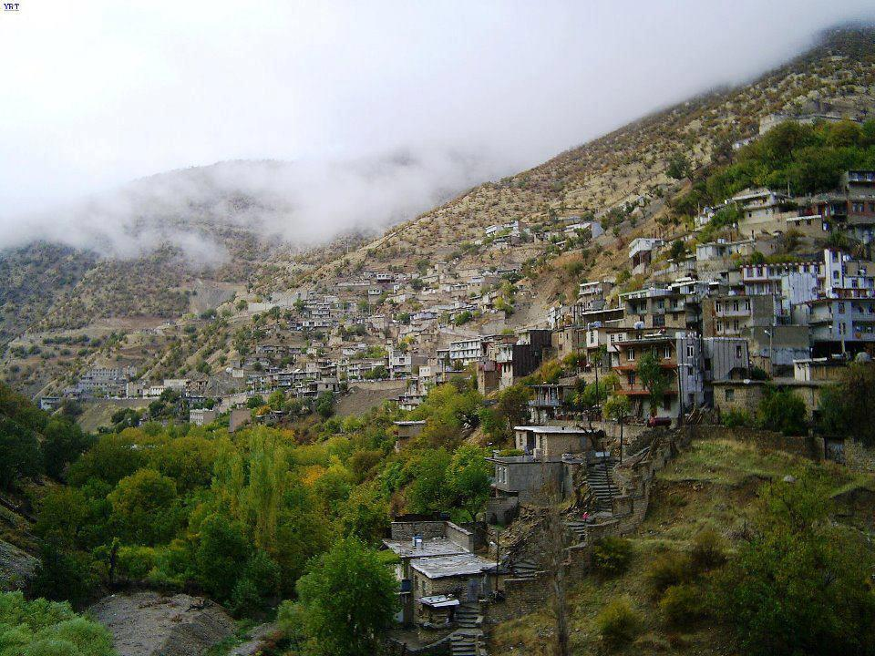
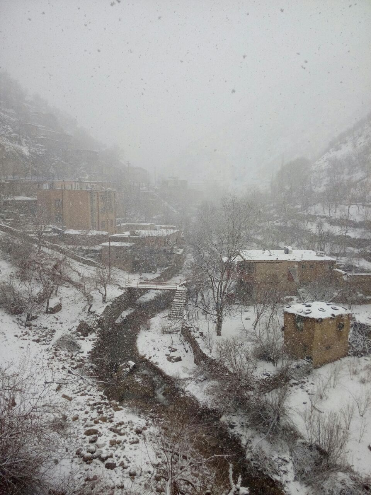
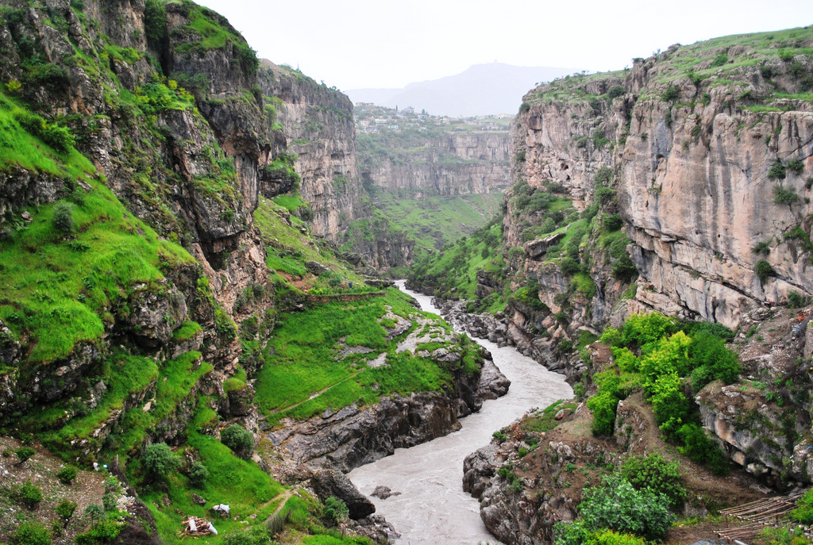

## Short Bio

>**Bahman Rostami-Tabar** is a Professor of Analytics and Decision Science in the [Department of Logistics and Operations Management](https://www.cardiff.ac.uk/business-school/about-us/sections/logistics-and-operations-management) at [Cardiff Business School](https://www.cardiff.ac.uk/business-school), [Cardiff University](https://www.cardiff.ac.uk/). He is the founder and Director of the [Data Lab for Social Good Research Group](https://www.cardiff.ac.uk/research/explore/research-units/data-lab-for-social-good) at Cardiff University and the founder of the [Forecasting for Social Good](https://forecasters.org/programs/communities/forecasting-for-social-good-f4sg/) at the International Institute of Forecasters. He also leads the [Uncertainty & the Future](https://www.cardiff.ac.uk/digital-transformation-innovation-institute/work-with-us/uncertainty-and-the-future) theme at the Digital Transformation Innovation Institute. Bahman’s research lies at the intersection of analytics, uncertainty, and decision sciences, with a particular emphasis on probabilistic modelling, forecasting, and operational research for planning and decision-making under uncertainty. His work is strongly motivated by real-world impact and has contributed to sectors focused on social good, including healthcare operations, global health and humanitarian logistics and supply chains, agriculture and food systems, social sustainability, and governmental policy. He is the author of over 40 research papers and 1 book. In recognition of his contributions to Operational Research and decision sciences, Bahman received the Goodeve Medal in 2024 from the [Operational Research Society](https://www.theorsociety.com/) for outstanding contributions to the field. In 2025, he was awarded the Lyn Thomas Impact Medal for academic OR research demonstrating both methodological novelty and clear, evidenced real-world impact.

:::: {.columns}

::: {.column width="30%"}
 [bahmanrostamitabar](https://github.com/bahmanrostamitabar) 

 [bahman-rostami-tabar](https://www.linkedin.com/in/bahman-rostami-tabar-1046171a/) 

🌐 [bahmanrostamitabar.github.io](https://bahmanrostamitabar.github.io/)

:::

::: {.column width="30%"}

 [bahmanrostamitabar](https://github.com/bahmanrostamitabar) 

 [bahman-rostami-tabar](https://www.linkedin.com/in/bahman-rostami-tabar-1046171a/) 

🌐 [bahmanrostamitabar.github.io](https://bahmanrostamitabar.github.io/)

:::

::: {.column width="30%"}

 [bahmanrostamitabar](https://github.com/bahmanrostamitabar) 

 [bahman-rostami-tabar](https://www.linkedin.com/in/bahman-rostami-tabar-1046171a/) 

🌐 [bahmanrostamitabar.github.io](https://bahmanrostamitabar.github.io/)

:::

::::

 

I am Kurdish, born and raised in Kurdistan in the village of [Bayangan, Paveh, Kermanshah](https://www.openstreetmap.org/?mlat=34.980833&mlon=46.271389&zoom=15#map=14/34.97227/46.27240), in western Iran. Just a short half-hour drive from the border of Iraqi Kurdistan, this land of mountains, resilience, and deep history shaped who I am.

:::: {.columns}

::: {.column width="30%"}
{width="90%"}
:::

::: {.column width="30%"}

{width="50%" fig-align="center"}
:::

::: {.column width="30%"}
{width="95%"}
:::

::::

After high school, I moved to Tehran and studied Industrial Engineering, receiving my BSc. from K.N.Toosi University of Technology (2004). Following my graduation, I have worked in various companies in different industries as planning engineer in Tehran and South of Iran. I then decided to continue my studies and received my MSc in Industrial Engineering from Tarabiat Modares University(2008). After working in the project management filed for two years, I moved to France in 2010 to pursue a PhD, and received my PhD from the University of Bordeuax, France in 2014. Following that, I have spent two years at Ecole Central-Supelec for my post doctoral reserach.

## Qualifications

- PhD in Industrial Engineering, 2014, University of Bordeaux
- MSc. in Information Systems, 2010, ECE Paris
- MSc. in Industrial Engineering, 2008, Tarbiat Modares University
- BSc. in Industrial Engineering, 2004, K.N.Toosi University of Technology

## Employment history

  * **Professor**, Cardiff Business School, Cardiff University, 2023--Present, UK.
  * **Reader**, Cardiff Business School, Cardiff University, 2020--2023, UK.
  * **Senior Lecturer**, Cardiff Business School, Cardiff University, 2019--2020, UK.
  * **Lecturer**, Cardiff Business School, Cardiff University, 2016--2019, UK.
  * **Lecturer**, School of Strategy and Leadership, Coventry University, 2015--2016, UK.
  * **Postdoctoral Researcher**, Industrial Engineering Lab, Ecole Centrale Paris, 2014--2015, France.

## Awards and honours

* 2025, Lyn Thomas Impact Medal winner, Operational Research Society, UK.
* 2024, Goodeve Medal winner, Operational Research Society, UK.
* 2024, Fellowship, Institute of Advanced Studies, Montpellier, France.
* 2013 MIM best paper award (IFAC).
* 2017 International Symposium on Industrial Engineering and Operations Management, Best Track Paper Award, Bristol, UK.

## Society leadership

  * Founder and chair, Forecasting fro Social Good, [International Institute of Forecasters], 2022--2025
  * Member, Research Committee, [The Operational Research Society](http://www.statsoc.org.au), 2025--present
  * Central Council member, [Statistical Society of Australia](http://www.statsoc.org.au), 1993--1996.

## Fellowships

  * Public Value Fellow, Cardiff Business School, 2021.
  * Associate Fellow, NHS-R community, 2021.

## Society memberships

  * Member, [INFORMS](https://www.informs.org/)
  * Member, [The OR Society](https://www.theorsociety.com/)

## Academic and research leadership

  * **Founding Director**, Data Lab for Social Good Reserach Group, Cardiff University. 2022--Present
  * **Founding Director & Academic Lead**, The Art and Science of Uncertainty and the Future, and interdisiplinairy Summer School, Cardiff University. 2025--Present

## Editorial boards

  * Editor, *[International Journal of Forecasting](http://www.jstatsoft.org/)* (2025--Present).
  * Associate Editor, *[Journal of Operational Research Society](http://www.jstatsoft.org/)* (2023--Present).
  * Area Editor, [Health Systems](http://ideas.repec.org/n/nep-for/) (2023--2025).
  

## Address

**Mail:** [Cardiff Business School](https://www.cardiff.ac.uk/business-school), Cardiff University.

**Office:** Office C08, Aberconway Building, 3 Colum Drive, CF10 3EU, Cardiff, Wales, United Kingdom

<iframe 
  src="https://www.google.com/maps?q=Aberconway%20Building%2C%20CF10%203EU&output=embed"
  width="640"
  height="480"
  style="border:0;"
  loading="lazy"
  referrerpolicy="no-referrer-when-downgrade">
</iframe>

