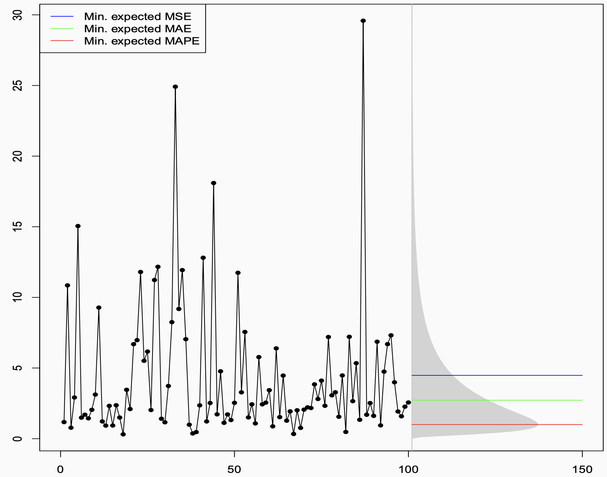

## The Setup

Imagine you are a forecaster. You have done everything right. You have studied your data carefully, built a solid model, and — in a rare stroke of luck — you actually *know* the true data-generating process. The numbers come from a log-normal distribution. No estimation uncertainty, no model misspecification. You know the truth.

So what is your forecast?

If your instinct is to say "well, that's easy — just compute the optimal value from the distribution," you are already halfway to the point of this story. Because the uncomfortable answer is: **it depends.** Even with perfect knowledge of the true distribution, there is no single "best" point forecast. There are several — and which one is right depends entirely on a question most forecasters never explicitly ask:

> *What are you actually trying to minimize?*

## The Figure That Started the Conversation

The plot below shows a time series generated from a log-normal distribution. The historical observations are on the left — volatile, spiky, with a few dramatic peaks pulled upward by the distribution's heavy right tail. On the right, the grey shaded region shows the future prediction interval, derived analytically from the known distribution.

{fig-alt="Time series from a log-normal distribution with three horizontal forecast lines corresponding to minimum MSE (mean), MAE (median), and MAPE (mode). " width="70%"}

Then there are three horizontal lines. Three different answers to the question *"what is the best point forecast?"* — all of them correct, in their own way:

- The **blue line (~4.5)** is the mean. It sits noticeably high, dragged upward by the tail.
- The **green line (~2.5)** is the median. It sits closer to where the data actually spends most of its time.
- The **red line (~1)** is even lower, near the mode. It almost hugs the bottom of the distribution.

Three forecasters, all working from the same known distribution, all doing the math correctly, all producing different numbers. How?

---

## The Decision-Theoretic Answer

The answer lies in a beautiful and underappreciated result from decision theory. Given a true predictive distribution, each error measure is minimised — **in expectation, over future outcomes** — by a different summary of that distribution:

| Error Measure | Optimal Point Forecast |
|---|---|
| **MSE** (Mean Squared Error) | Conditional **mean** |
| **MAE** (Mean Absolute Error) | Conditional **median** |
| **MAPE** (Mean Absolute Percentage Error) | **"−1 median"** ≈ mode (for skewed distributions) |

: Optimal point forecasts under different loss functions {.striped}

- **MSE** is minimised by the **mean**. Squared errors penalise large deviations heavily, so the optimal forecast balances out the tails, landing at the expectation.
- **MAE** is minimised by the **median**. Absolute errors treat all deviations equally, so the optimal forecast sits at the middle of the distribution.
- **MAPE** is minimised by the **"−1 median"** — a quantity that, in skewed distributions like the log-normal, sits near the mode. Because MAPE penalises errors *relative* to the actual value, it is especially harsh about over-forecasting, pushing the optimal forecast downward.

::: {.callout-note}
This is not about model fitting or training data. This is **pure mathematics**, derived directly from the shape of the true predictive distribution. The figure is essentially asking: *if you knew the truth, what would you say?* The answer: *it depends on what you will be penalised for.*
:::

## From Theory to Practice: The Training Loss Connection

Of course, in real forecasting you do not know the true distribution. You have to learn it from data — which means choosing a **training loss function**.

This is where the two worlds connect, through the concept of **consistent loss functions**.

The **out-of-sample metric** tells you *what* you want to produce: it identifies the target functional of the predictive distribution. The **training loss** is the mechanism by which your model *learns* to produce that functional from data. For this to work, the two must be aligned:

- Train with **MSE** → model learns the conditional **mean** → evaluate out-of-sample with MSE or relatee measures like RMSE, RMSSE. ✅
- Train with **MAE** → model learns the conditional **median** → evaluate with MAE, or MASE. ✅

The failure mode — surprisingly common — is when the training loss and the evaluation metric are **inconsistent**. The model is trained to produce one thing, and then judged on another. It is a bit like training an athlete to run sprints and then entering them in a marathon, and wondering why the results are disappointing.

## When the Right Metric Produces the Wrong Forecast

Getting the math right is necessary but not sufficient. You also have to make sure the metric you are optimising is actually **meaningful for your business problem**.

### The Intermittent Demand Trap

Consider **intermittent demand** — products that sit on a shelf for days or weeks without selling, punctuated by occasional purchases. The data is mostly zeros. The median is zero. A forecaster who sets out to minimise MAE will, quite correctly from a mathematical standpoint, produce a **flat zero forecast**. Zero errors on every zero-demand day. The metric looks great. The business is not happy.

### The MAPE Trap

Optimising for MAPE might deliver a lower error score — and perhaps a better performance bonus. But because MAPE systematically pushes forecasts downward, it often produces forecasts that are too conservative for real business decisions. Good for the scorecard, bad for the outcome.It also does not work well when the data has zeros or near-zeros, which is common in many real-world forecasting problems.

::: {.callout-warning}
The lesson is not that these metrics are useless. It is that **a metric is only as good as its alignment with the actual decision being made.**
:::

## A Framework: Start at the End

All of this points toward a simple but powerful shift in how to approach forecasting. Instead of starting with the model and hoping the metric works out, **start at the end and work backwards**:

**1. Understand what your forecast will be used for.**

An inventory replenishment decision has very different error consequences than a budget planning model or a risk assessment. The use case defines what "good" means.

**2. Deduce what functional of the predictive distribution you need.**

Do you need the mean? The median? A specific quantile to hit a desired service level? This follows directly from step one.

**3. Pick an error measure — a PFEM — that is consistent with that functional.**

MSE for the mean, MAE for the median, quantile (pinball) loss for a quantile. This measure should govern **both** how you train your model *and* how you evaluate it out-of-sample.

For example, a quantile forecast evaluated with pinball loss for inventory replenishment, or MSE if the expectation is what drives the downstream decision.

**4. Only then start modelling, fitting, and forecasting.**

With the objective clearly defined and consistently applied, your model will be trained to produce exactly what the decision requires, and evaluated fairly against that same standard.

## The Punchline

The figure is deceptively simple — three coloured lines over a noisy time series. But it encodes something profound:

> **The data does not tell you what to forecast. Your decision context does.**

No amount of modelling sophistication, no clever architecture or careful hyperparameter tuning, can compensate for optimising the wrong objective from the start. The best forecasters are not just good at fitting models — they are disciplined about asking, before anything else, *what does "best" actually mean here?*

Get that question right, align your training loss and your evaluation metric accordingly, and the math will take care of the rest.

## Learn more

- [Forecast quality](https://dfep.netlify.app/sec-quality)-Kolassa, Stephan, Bahman Rostami-Tabar, and Enno Siemsen. Demand forecasting for executives and professionals. Chapman and Hall/CRC, 2023.

- [Stephan Kolassa, ISF 2024 Practitioner Speaker](https://youtu.be/i4E0p7-cx1Q?si=_m6U-FXgzWb5gqA0)
