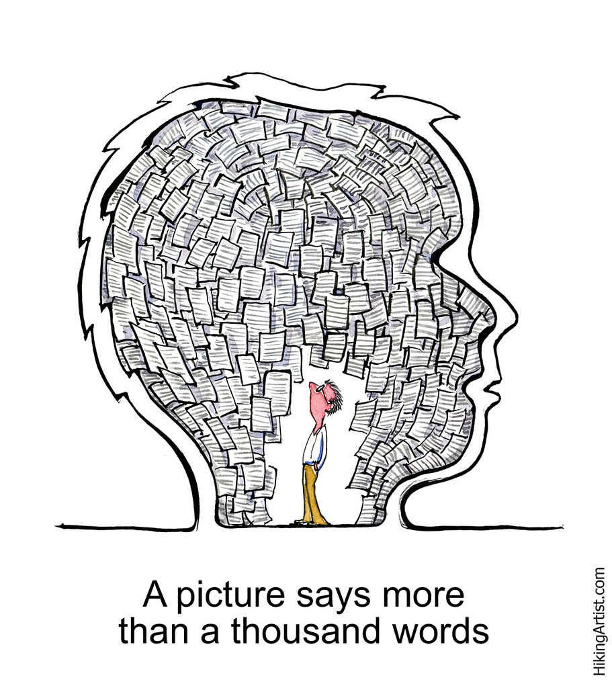
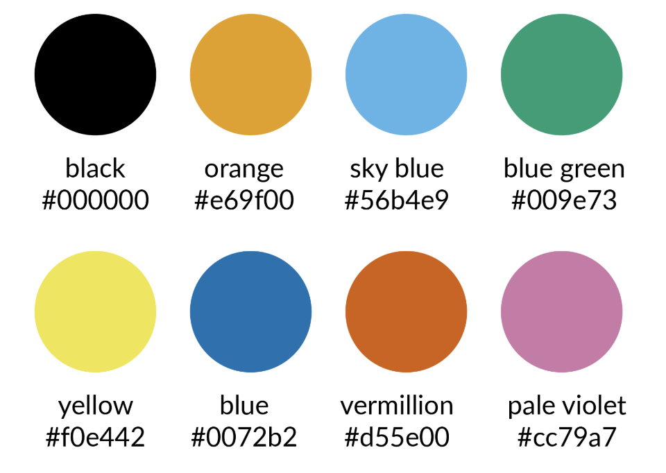
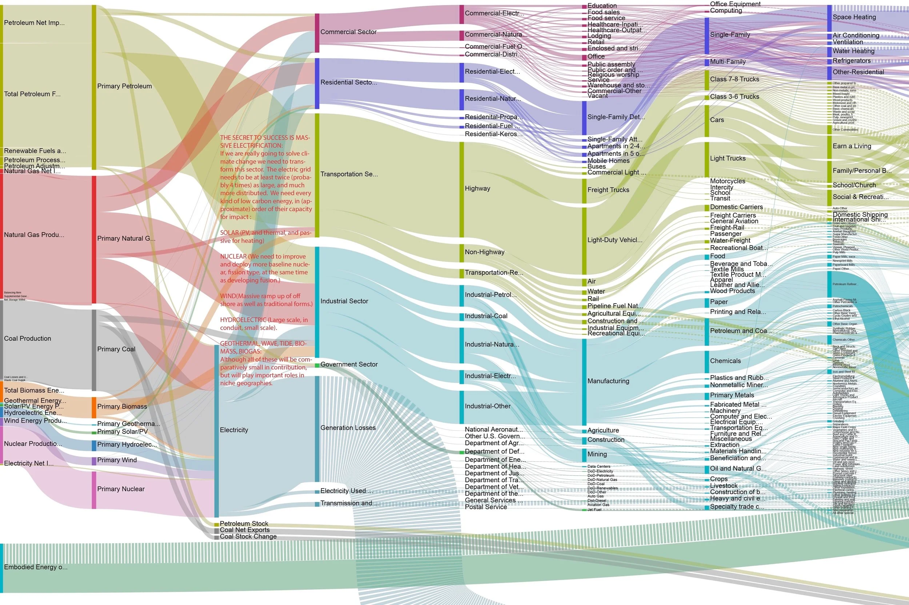

## 

:::: {.columns}
::: {.column width="30%"}
{.image-left}
:::

::: {.column width="70%"}
### Agenda

- Design philosophy for scientific slides

- Visual and typographic principles

- Technical and practical safeguards

- Delivery skills

:::
::::

::: {.footer}
 [bahmanrostamitabar](https://github.com/bahmanrostamitabar)  [bahman-rostami-tabar](https://www.linkedin.com/in/bahman-rostami-tabar-1046171a/) 🌐 [bahmanrostamitabar.github.io](https://bahmanrostamitabar.github.io/)
:::

# Making Slides {.big footer=false}

## The Design Philosophy

::: {.incremental}
- **Signal-to-Noise Ratio:** Maximize insight, minimize clutter, get rid of what's not essential.  

- **Cognitive Load:** The brain handles about six visual elements at once.
   - Aim for 3–6 visual elements per slide.

- **The Rule of Three:** Organize your talk into three or four distinct "messages." The audience will not remember more than this

- **One Idea Per Slide:** Each slide must have a single, central objective.
:::

## Know Your Audience  {background-image="img/phdfoundation/audiance.jpg" background-size="contain" background-position="right" footer=false .center}

:::: {.columns}
::: {.column width="60%"}
- The Omniscience Trap: Do not assume the audience knows what you know. You have spent years on a specialty; they have not.

- Tailor content to audience expertise and interests. You may need to make assumptions!
:::

::: {.column width="40%"}
:::
::::

## Visuals Over Text

:::: {.columns}
::: {.column width="50%"}

- **Hierarchy of Understanding:** Figures are easier to understand than words; words are easier to understand than equations.

- **Graphics**: Never have a slide that is only text. Build slides around visualizations.

- **Show, Don't Just Tell:** Use visuals and examples to illustrate points rather than just describing them
:::

::: {.column width="50%"}
{width=100% fig-align="center"}
:::
::::

## Use bullet points and short text

- **Bullet Points Only:** Avoid full sentences and paragraphs

- **Sentence Headlines:** Titles should state findings/message/conclusions.  

- **Redundancy is Good:** Short text can reinforce spoken words. 

- **Citations:** Place citations directly on relevant slides [^1].

[^1]: For more info: [https://subjectguides.york.ac.uk/presentations/design](https://subjectguides.york.ac.uk/presentations/design)

## [Backgrounds and Layout]{.white} {style="color:#ffffff" background-image="img/phdfoundation/background.jpg" background-opacity="0.95" background-size="cover" background-position="center" footer=false}

- **Go Blank:** Avoid templates and themes. 

- **Background Color Choice:** Prefer solid white, white-gray

- **Image Backgrounds:** Desaturate or darken/lighten to avoid distraction.

## Typography Rules

- **Font Family:** Use sans-serif fonts (Arial, Helvetica, etc).

- **Font Size:** Default sizes are usually too small.  
  - Titles: 44 pt  
  - Subtitles: 36 pt
  - Body Text: 32 pt  
  - Captions/footnote: 18–24 pt

- **Emphasis:** Use bold, not italics, underlining, or ALL CAPS.  
    - You can use color for [emphasis]{.remember}, but limited numebrs.

- **Consistency:** Keep font roles and collors consistent across slides.

## Font Color  

- Use BlaCK or Dark Gray for text on light backgrounds.
- Use White or Light Gray for text on dark backgrounds.
- **Limit Palette:** Use 2–4 main colors.
- **Accessibility:** Use color-blind friendly palettes. 

{width=100% fig-align="center"}

## Visualiziations

:::: {.columns}
::: {.column width="40%"}
- **High Quality:** Use sharp, high-resolution graphics.

- **Readability:** Ensure text in figures is legible, if you say sorry for it, it's too small, then question why you included it.
:::

::: {.column width="60%"}
{width=100% fig-align="center"}

:::
::::

## Equations {footer=false}
**Simplify Equations:** Treat equations as visuals; define all symbols.  

:::: {.columns}
::: {.column width="40%"}

$$
\begin{aligned}
\min_{x \in \mathbb{R}^n}\quad & f(x) = c^\top x \\
\text{s.t.}\quad & Ax \le b \\
& x \ge 0
\end{aligned}
$$
:::

::: {.column width="60%"}

- $x \in \mathbb{R}^n$ is the **decision vector**, $n$ is the number of variables.
- $f(x)$ is the **objective function value**.
- $c \in \mathbb{R}^n$ is the **cost (or weight) vector**.
- $c^\top x$ is the **dot product**.
- $A \in \mathbb{R}^{m\times n}$ is the **constraint matrix**, $m$ is the number of constraints.
- $b \in \mathbb{R}^m$ is the **right-hand-side vector** of constraint limits.
- $Ax \le b$ represents **$m$ linear inequalities**.
- $x \ge 0$ is the **nonnegativity constraint**.
:::
::::

## Motion and Transitions

- **No Animations:** Avoid flying text and fancy transitions.  

- **Build Method:** Use multiple slides for progressive diagrams and to explain complex ideas.  

::: {.fargragments}

:::

## Navigation and Accessibility

- **Slide Numbers:** Always include them.  

- **Table of Contents:** Repeat with current section highlighted.

- **Extra slides** at the end for FAQs or detailed info.

## Technical Formatting & Safety

- **PDF is King:** Export final slides as PDF. 

- **Backup:** Always have a backup on a USB drive.

- **website:** if you use revealjs or similar, host a copy online as backup.

# Delivery {.big footer=false}

## The Vocal & Verbal

- **Don't Memorize Text.** Memorize your outline as a tree of ideas and speak extemporaneously.

- **Embrace Silence.** Avoid filler words such as *um* and *er*. A pause is better; it gives you time to think and the audience time to process.

- **Volume and Tone.** Speak loudly and firmly. Vary your rate and volume based on the complexity of the information.

- **Explicit Language.** Avoid vague pronouns like *this* or *that*. Say *that figure* or *that equation* to be precise.

## Body Language

- **Face the Audience.** Do not turn your back to read the screen.

- **Eye Contact.** Engage the audience by looking at different parts of the room.

- **Pointers.** Prefer a solid stick. Laser pointers move too fast, and mouse pointers are hard to follow and can cause motion sickness.

- **Nerves.** Stage fright is normal. It shows you care. Channel that energy into your voice and gestures.

## The Q&A and Mishaps

- **Honesty is Key.** If you do not know the answer, say so. If you simplified something, admit it.

- **No Apologies.** Do not apologize for your English, your nerves, or technical issues. never start with an apology.

- **Handling Interruptions.** If a question requires a long detour, suggest postponing it until the end.

## The Golden Rules

- **Never Go Over Time.** If time runs out, stop and summarize immediately.

- **Practice.** Practice reveals missing vocabulary and smooths transitions. Minimum 10 timed rehearsals.

- **Iterate.** Rehearse with peers to discover unclear points and weak parts of the story.

## [You made it!]{.graylight} 🎉 {background-iframe="https://particles.js.org/samples/presets/fireworks.html#google_vignette" footer=false}

## References {background-image="https://images.unsplash.com/photo-1550399105-05c4a7641b02?ixlib=rb-1.2.1&ixid=MnwxMjA3fDB8MHxwaG90by1wYWdlfHx8fGVufDB8fHx8&auto=format&fit=crop&w=774&q=80" background-size="contain" background-position="right"}

Books:
- [slide:ology](https://a.co/d/arZXMHE)
- [Presentation Zen](https://amzn.eu/d/cuR345A)
- [The Craft of Scientific Presentations](https://amzn.eu/d/gM7o49Y)

Free photos:
- [unsplash.com](https://unsplash.com/)
- [pexels.com](https://www.pexels.com/)

## Details {visibility="uncounted"}

- Some content adapted from:  
  - "The Craft of Scientific Presentations" by Michael Alley  
  - "Presentation Zen" by Garr Reynolds  
  - "Slide:ology" by Nancy Duarte  
  - "Resonate" by Nancy Duarte  

## Acknowledgments {visibility="uncounted"}

- Thanks to colleagues and mentors who provided feedback on presentation skills and design principles over the years.
- Image credits to respective photographers and sources for visual materials used in this presentation.
