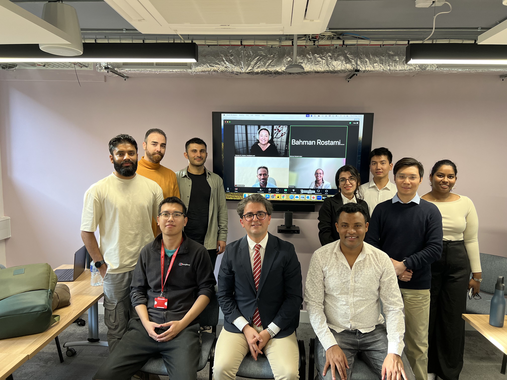
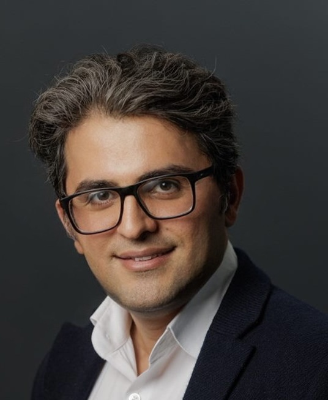
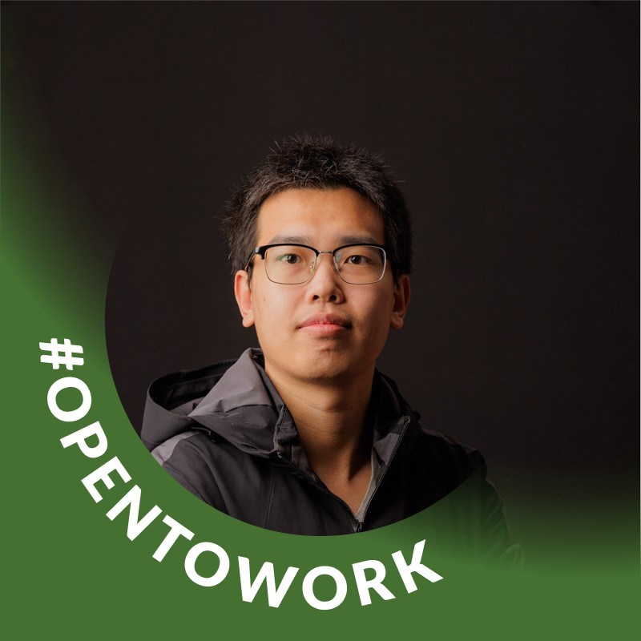
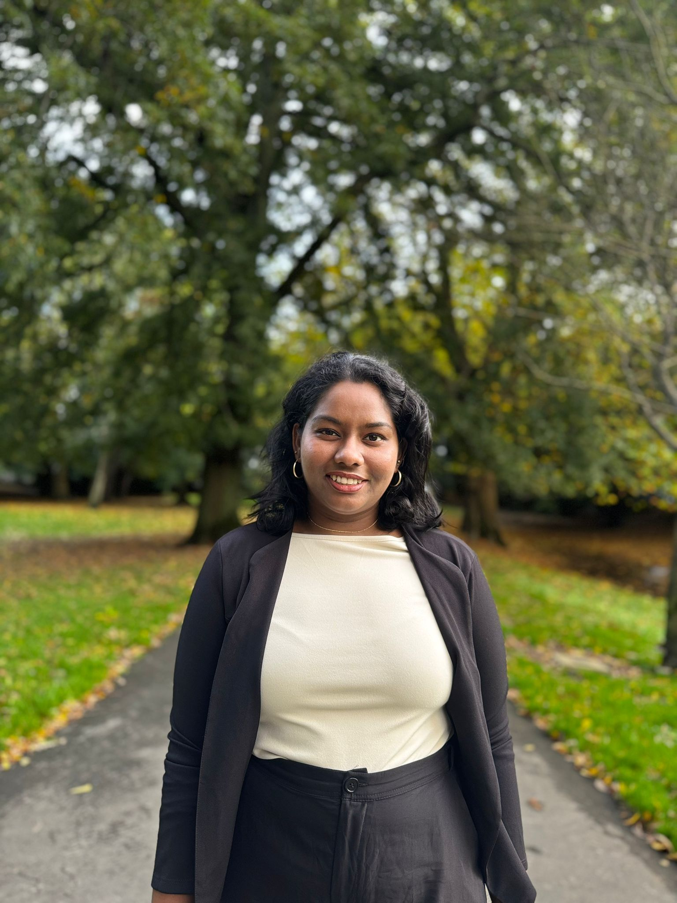

```{=html}
<div style="display:flex; justify-content:center; margin:2.5rem 0;">
  <figure style="text-align:center;">
    
    <figcaption style="
        margin-top:0.6rem;
        font-style:italic;
        color:#555;
        font-size:0.95rem;
      ">
      Data Lab for Social Good Research Group (Photo taken in 2024)
    </figcaption>
  </figure>
</div>
```


## Founding Director

```{=html}
<div class="page-container">
    <!-- Participants Section -->
    <div class="content-card">
        <div class="participants-grid">
            
            <!-- Participant 1 -->
            <div class="participant-card">
                
                <div class="participant-name">Prof. Bahman Rostami-Tabar</div>
                <div class="participant-affiliation">Cardiff University</div>
                <ul class="participant-links">
                    <li><a href="https://profiles.cardiff.ac.uk/staff/rostami-tabarb" target="_blank" class="website" title="Website"><i class="bi bi-globe"></i></a></li>
                    <li><a href="https://github.com/bahmanrostamitabar" target="_blank" class="github" title="GitHub"><i class="bi bi-github"></i></a></li>
                    <li><a href="https://www.linkedin.com/in/bahman-rostami-tabar-1046171a/" target="_blank" title="LinkedIn"><i class="bi bi-linkedin"></i></a></li>
                </ul>
            </div>
            
        </div>
    </div>
</div>
```


## Academic Staff

```{=html}
<div class="page-container">
    <!-- Participants Section -->
    <div class="content-card">
        <div class="participants-grid">
            
            <!-- Participant 1 -->
            <div class="participant-card">
                
                <div class="participant-name">Dr. Thanos Goltsos</div>
                <div class="participant-affiliation">Cardiff University</div>
                <ul class="participant-links">
                    <li><a href="https://hdrwales.org.uk/portfolio/dr-zihao-wang/" target="_blank" class="website" title="Website"><i class="bi bi-globe"></i></a></li>
                    <li><a href="#" target="_blank" class="github" title="GitHub"><i class="bi bi-github"></i></a></li>
                    <li><a href="https://www.linkedin.com/in/zihao-wang-040b63244/" target="_blank" title="LinkedIn"><i class="bi bi-linkedin"></i></a></li>
                </ul>
            </div>
            
            
                        <!-- Participant 2 -->
            <div class="participant-card">
                
                <div class="participant-name">Dr. Xun (Paul) Wang</div>
                <div class="participant-affiliation">Cardiff University</div>
                <ul class="participant-links">
                    <li><a href="https://experts.exeter.ac.uk/45619-diego-bermudez/about" target="_blank" class="website" title="Website"><i class="bi bi-globe"></i></a></li>
                    <li><a href="#" target="_blank" class="github" title="GitHub"><i class="bi bi-github"></i></a></li>
                    <li><a href="https://www.linkedin.com/in/diegobermudezb/" target="_blank" title="LinkedIn"><i class="bi bi-linkedin"></i></a></li>
                </ul>
            </div>

                        <!-- Participant 3 -->
            <div class="participant-card">
                
                <div class="participant-name">Dr. Danni Zhang</div>
                <div class="participant-affiliation">Cardiff University</div>
                <ul class="participant-links">
                    <li><a href="https://experts.exeter.ac.uk/45619-diego-bermudez/about" target="_blank" class="website" title="Website"><i class="bi bi-globe"></i></a></li>
                    <li><a href="#" target="_blank" class="github" title="GitHub"><i class="bi bi-github"></i></a></li>
                    <li><a href="https://www.linkedin.com/in/diegobermudezb/" target="_blank" title="LinkedIn"><i class="bi bi-linkedin"></i></a></li>
                </ul>
            </div>

            
        </div>
    </div>
</div>
```


## Honarary Research Fellows & Visiting Professors


```{=html}
<div class="page-container">
    <!-- Participants Section -->
    <div class="content-card">
        <div class="participants-grid">
            
            <!-- Participant 1 -->
            <div class="participant-card">
                
                <div class="participant-name">Prof. Mohammed Mohammed</div>
                <div class="participant-affiliation">The Startegy Uni-NHS</div>
                <ul class="participant-links">
                    <li><a href="https://hdrwales.org.uk/portfolio/dr-zihao-wang/" target="_blank" class="website" title="Website"><i class="bi bi-globe"></i></a></li>
                    <li><a href="#" target="_blank" class="github" title="GitHub"><i class="bi bi-github"></i></a></li>
                    <li><a href="https://www.linkedin.com/in/zihao-wang-040b63244/" target="_blank" title="LinkedIn"><i class="bi bi-linkedin"></i></a></li>
                </ul>
            </div>
            
            
                        <!-- Participant 2 -->
            <div class="participant-card">
                
                <div class="participant-name">Dr. Laila Akhlaghi</div>
                <div class="participant-affiliation">JSI</div>
                <ul class="participant-links">
                    <li><a href="https://experts.exeter.ac.uk/45619-diego-bermudez/about" target="_blank" class="website" title="Website"><i class="bi bi-globe"></i></a></li>
                    <li><a href="#" target="_blank" class="github" title="GitHub"><i class="bi bi-github"></i></a></li>
                    <li><a href="https://www.linkedin.com/in/diegobermudezb/" target="_blank" title="LinkedIn"><i class="bi bi-linkedin"></i></a></li>
                </ul>
            </div>

                        <!-- Participant 3 -->
            <div class="participant-card">
                
                <div class="participant-name">Mr. Johann Robette</div>
                <div class="participant-affiliation">Vekia</div>
                <ul class="participant-links">
                    <li><a href="https://experts.exeter.ac.uk/45619-diego-bermudez/about" target="_blank" class="website" title="Website"><i class="bi bi-globe"></i></a></li>
                    <li><a href="#" target="_blank" class="github" title="GitHub"><i class="bi bi-github"></i></a></li>
                    <li><a href="https://www.linkedin.com/in/diegobermudezb/" target="_blank" title="LinkedIn"><i class="bi bi-linkedin"></i></a></li>
                </ul>
            </div>

            
        </div>
    </div>
</div>
```


## Current Ph.D. student

```{=html}
<div class="page-container">
    <!-- Participants Section -->
    <div class="content-card">
        <div class="participants-grid">
            
            <!-- Participant 1 -->
            <div class="participant-card">
                
                <div class="participant-name">Harsha Halgamuwe Hewage</div>
                <div class="participant-affiliation">Cardiff University</div>
                <ul class="participant-links">
                    <li><a href="https://chamara7h.github.io/" target="_blank" class="website" title="Website"><i class="bi bi-globe"></i></a></li>
                    <li><a href="https://github.com/chamara7h" target="_blank" class="github" title="GitHub"><i class="bi bi-github"></i></a></li>
                    <li><a href="https://www.linkedin.com/in/harshachamara/" target="_blank" title="LinkedIn"><i class="bi bi-linkedin"></i></a></li>
                </ul>
            </div>

            <!-- Participant 2 -->
            <div class="participant-card">
                
                <div class="participant-name">Minzhe Shi</div>
                <div class="participant-affiliation">Cardiff University</div>
                <ul class="participant-links">
                    <li><a href="https://profiles.cardiff.ac.uk/research-staff/shim9" target="_blank" class="website" title="Website"><i class="bi bi-globe"></i></a></li>
                    <li><a href="https://github.com/Shimingzhe123" target="_blank" class="github" title="GitHub"><i class="bi bi-github"></i></a></li>
                    <li><a href="https://www.linkedin.com/in/mingzhe-shi-0a22451b9/" target="_blank" title="LinkedIn"><i class="bi bi-linkedin"></i></a></li>
                </ul>
            </div>

            <!-- Participant 3 -->
            <div class="participant-card">
                
                <div class="participant-name">Udeshi Salgado</div>
                <div class="participant-affiliation">Cardiff University</div>
                <ul class="participant-links">
                    <li><a href="https://udeshisalgado.github.io/" target="_blank" class="website" title="Website"><i class="bi bi-globe"></i></a></li>
                    <li><a href="https://github.com/udeshisalgado" target="_blank" class="github" title="GitHub"><i class="bi bi-github"></i></a></li>
                    <li><a href="https://www.linkedin.com/in/udeshi-salgado/" target="_blank" title="LinkedIn"><i class="bi bi-linkedin"></i></a></li>
                </ul>
            </div>

            <!-- Participant 4 -->
            <div class="participant-card">
                
                <div class="participant-name">Fatemeh Monshizadeh</div>
                <div class="participant-affiliation">Cardiff University</div>
                <ul class="participant-links">
                    <li><a href="https://profiles.cardiff.ac.uk/staff/monshizadehf" target="_blank" class="website" title="Website"><i class="bi bi-globe"></i></a></li>
                    <li><a href="https://scholar.google.com/citations?user=tRs6Kvn7GacC&hl=en" target="_blank" class="github" title="GitHub"><i class="bi bi-github"></i></a></li>
                    <li><a href="https://www.linkedin.com/in/fatemeh-monshizadeh/" target="_blank" title="LinkedIn"><i class="bi bi-linkedin"></i></a></li>
                </ul>
            </div>

            <!-- Participant 5 -->
            <div class="participant-card">
                
                <div class="participant-name">Mustafa Aslan</div>
                <div class="participant-affiliation">Cardiff University</div>
                <ul class="participant-links">
                    <li><a href="https://mustafaslancoto.github.io/" target="_blank" class="website" title="Website"><i class="bi bi-globe"></i></a></li>
                    <li><a href="https://github.com/mustafaslanCoto" target="_blank" class="github" title="GitHub"><i class="bi bi-github"></i></a></li>
                    <li><a href="https://www.linkedin.com/in/aslanmu/" target="_blank" title="LinkedIn"><i class="bi bi-linkedin"></i></a></li>
                </ul>
            </div>

            <!-- Participant 6 -->
            <div class="participant-card">
                
                <div class="participant-name">Amir Salimi Babmiri</div>
                <div class="participant-affiliation">Cardiff University</div>
                <ul class="participant-links">
                    <li><a href="https://profiles.cardiff.ac.uk/staff/salimibabamiria" target="_blank" class="website" title="Website"><i class="bi bi-globe"></i></a></li>
                    <li><a href="https://scholar.google.com/citations?user=LDZrogIAAAAJ&hl=en&oi=sra" target="_blank" class="github" title="GitHub"><i class="bi bi-github"></i></a></li>
                    <li><a href="https://www.linkedin.com/in/amir-salimi-babamiri/" target="_blank" title="LinkedIn"><i class="bi bi-linkedin"></i></a></li>
                </ul>
            </div>

            <!-- Participant 7 -->
            <div class="participant-card">
                
                <div class="participant-name">Rui Xu</div>
                <div class="participant-affiliation">Cardiff University</div>
                <ul class="participant-links">
                    <li><a href="https://rui-2024.github.io/" target="_blank" class="website" title="Website"><i class="bi bi-globe"></i></a></li>
                    <li><a href="https://github.com/Rui-2024" target="_blank" class="github" title="GitHub"><i class="bi bi-github"></i></a></li>
                    <li><a href="https://www.linkedin.com/in/rui-xu-1bb216275/" target="_blank" title="LinkedIn"><i class="bi bi-linkedin"></i></a></li>
                </ul>
            </div>

            <!-- Participant 8 -->
            <div class="participant-card">
                
                <div class="participant-name">Amirhossein Ghadiri</div>
                <div class="participant-affiliation">Cardiff University</div>
                <ul class="participant-links">
                    <li><a href="https://amirhosseinghdv.github.io/" target="_blank" class="website" title="Website"><i class="bi bi-globe"></i></a></li>
                    <li><a href="https://github.com/amirhosseinghdv" target="_blank" class="github" title="GitHub"><i class="bi bi-github"></i></a></li>
                    <li><a href="https://www.linkedin.com/in/amirhossein-ghadiri-8296781a6/" target="_blank" title="LinkedIn"><i class="bi bi-linkedin"></i></a></li>
                </ul>
            </div>

            <!-- Participant 9 -->
            <div class="participant-card">
                
                <div class="participant-name">Alfred Sallwa</div>
                <div class="participant-affiliation">Mzumbe University</div>
                <ul class="participant-links">
                    <li><a href="https://alfred-ain.github.io/" target="_blank" class="website" title="Website"><i class="bi bi-globe"></i></a></li>
                    <li><a href="https://github.com/alfred-ain" target="_blank" class="github" title="GitHub"><i class="bi bi-github"></i></a></li>
                    <li><a href="https://www.linkedin.com/in/alfred-sallwa-b391b3302/" target="_blank" title="LinkedIn"><i class="bi bi-linkedin"></i></a></li>
                </ul>
            </div>

            <!-- Participant 10 -->
            <div class="participant-card">
                
                <div class="participant-name">Birhanu Shanko</div>
                <div class="participant-affiliation">Addis Ababa University</div>
                <ul class="participant-links">
                    <li><a href="https://orcid.org/0000-0003-4587-1742" target="_blank" class="website" title="Website"><i class="bi bi-globe"></i></a></li>
                    <li><a href="#" target="_blank" class="github" title="GitHub"><i class="bi bi-github"></i></a></li>
                    <li><a href="https://www.linkedin.com/in/birhanu-s-a45b2571/" target="_blank" title="LinkedIn"><i class="bi bi-linkedin"></i></a></li>
                </ul>
            </div>

            <!-- Participant 11 -->
            <div class="participant-card">
                
                <div class="participant-name">Yemsrach Demissie</div>
                <div class="participant-affiliation">Addis Ababa University</div>
                <ul class="participant-links">
                    <li><a href="https://orcid.org/0009-0005-4324-4843" target="_blank" class="website" title="Website"><i class="bi bi-globe"></i></a></li>
                    <li><a href="#" target="_blank" class="github" title="GitHub"><i class="bi bi-github"></i></a></li>
                    <li><a href="https://www.linkedin.com/in/yemsrach-hailu-demissie/" target="_blank" title="LinkedIn"><i class="bi bi-linkedin"></i></a></li>
                </ul>
            </div>
```


## Graduated Ph.D.

```{=html}
<div class="page-container">
    <!-- Participants Section -->
    <div class="content-card">
        <div class="participants-grid">
            
            <!-- Participant 1 -->
            <div class="participant-card">
                
                <div class="participant-name">Zihao Wang</div>
                <div class="participant-affiliation">Swansea University</div>
                <ul class="participant-links">
                    <li><a href="https://hdrwales.org.uk/portfolio/dr-zihao-wang/" target="_blank" class="website" title="Website"><i class="bi bi-globe"></i></a></li>
                    <li><a href="#" target="_blank" class="github" title="GitHub"><i class="bi bi-github"></i></a></li>
                    <li><a href="https://www.linkedin.com/in/zihao-wang-040b63244/" target="_blank" title="LinkedIn"><i class="bi bi-linkedin"></i></a></li>
                </ul>
            </div>
            
            
                        <!-- Participant 2 -->
            <div class="participant-card">
                
                <div class="participant-name">Diego Bermudez</div>
                <div class="participant-affiliation">University of Exeter</div>
                <ul class="participant-links">
                    <li><a href="https://experts.exeter.ac.uk/45619-diego-bermudez/about" target="_blank" class="website" title="Website"><i class="bi bi-globe"></i></a></li>
                    <li><a href="#" target="_blank" class="github" title="GitHub"><i class="bi bi-github"></i></a></li>
                    <li><a href="https://www.linkedin.com/in/diegobermudezb/" target="_blank" title="LinkedIn"><i class="bi bi-linkedin"></i></a></li>
                </ul>
            </div>
            
        </div>
    </div>
</div>
```


## Graduated MS.c.

** To be Completed **