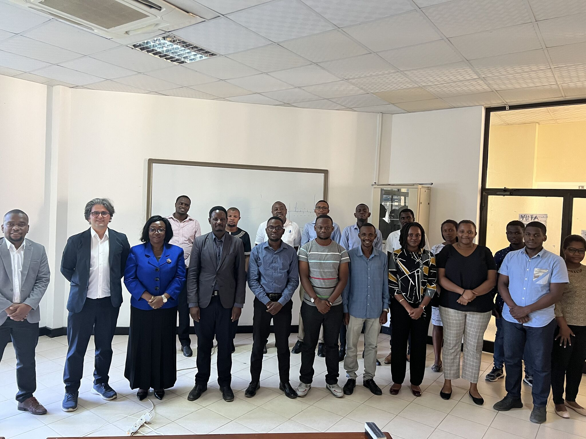
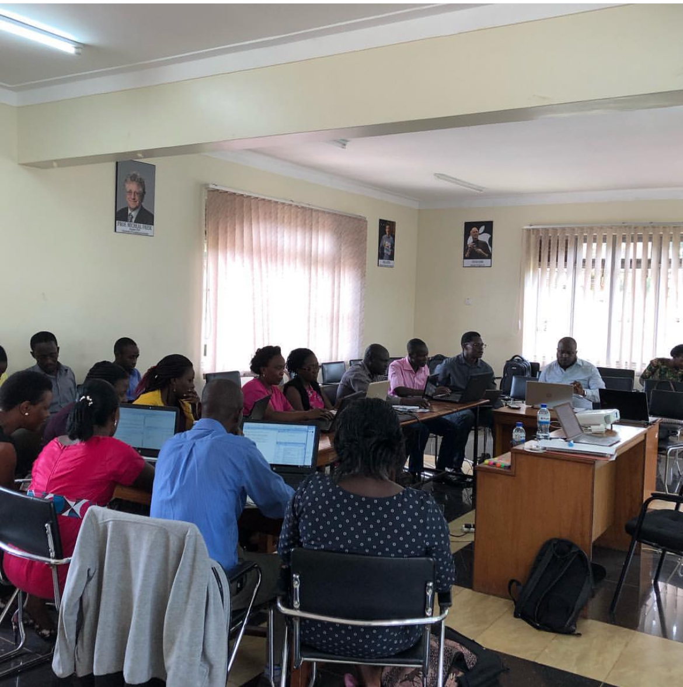
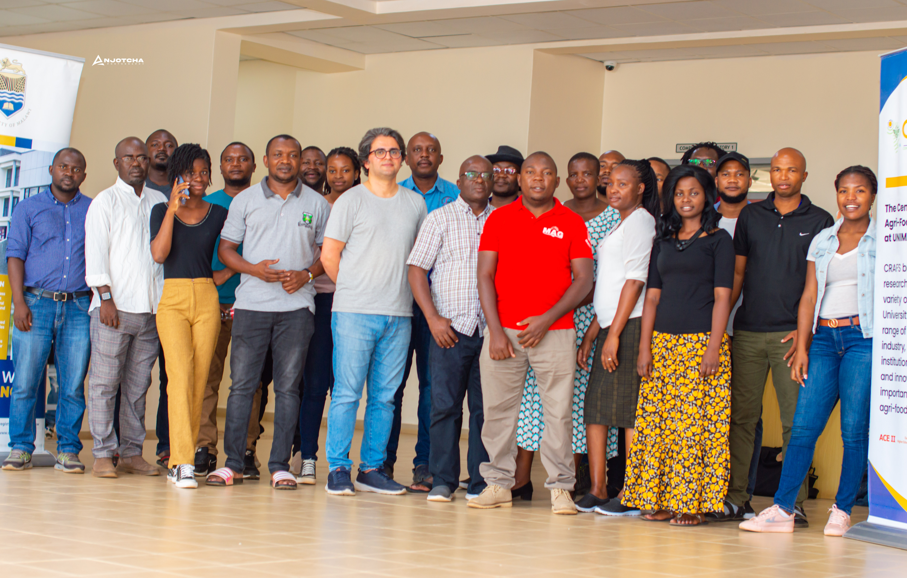
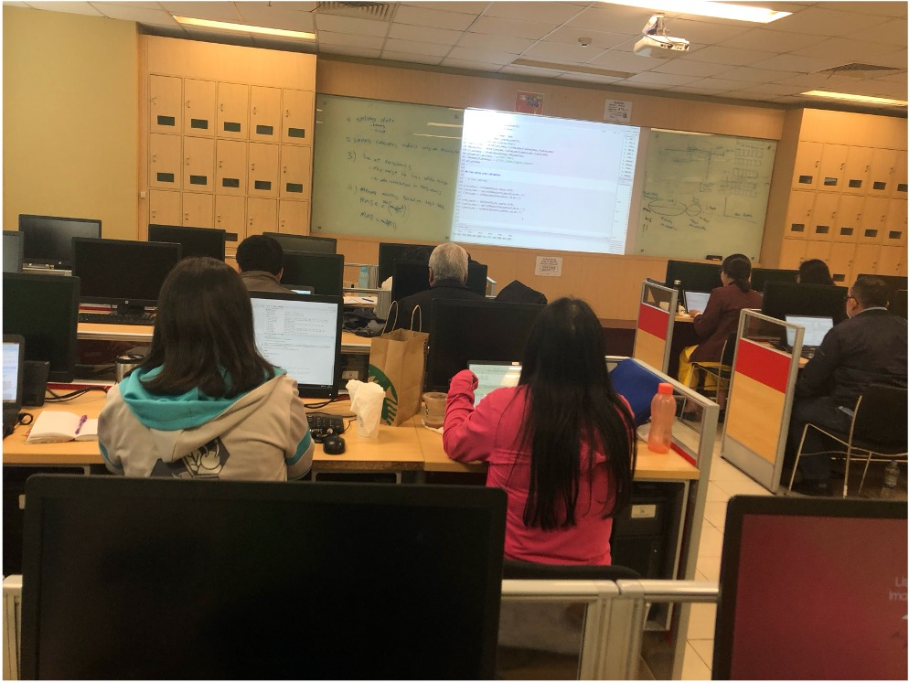
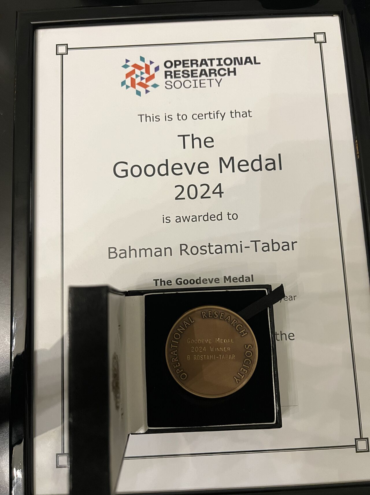

```{r}
#| label: setup
#| include: false

install.packages(c("tidyverse","palmerpenguins","kableExtra","broom","DiagrammeR","ggdag","ggraph","tidygraph","ggthemes", "reticulate", "countdown"))

library(tidyverse)
library(palmerpenguins)
library(kableExtra)# for elegamt tables
library(broom)# use to fit regression
library(DiagrammeR)
library(ggdag)
library(ggraph)
library(tidygraph)
```

# Create sldies

## Create slides using `##`

create a slide using `##` for slide title

# Section or special slide

# {.big}

::: r-fit-text
[Live Demo]{.flow}
:::

# Data visualisation best practices {.big}

## Data visualisation best practices {.big}

## {.big .middle .center}

:::: .{columns}
::: {.column width="45%"}
### Detailed, accurate, numbers?
:::

::: {.column width="10%"}
:::

::: {.column width="45%"}
### Or the big, picture message?
:::
::::

# Craete lists

## create bulleted list
create a  list using `- `, `+`, or `*`

- first bullet
- second bullet
- third bullet

## create ordered ist

1. first
2. second
3. third

# Multile columns

## Using multile columns 

sometimes you want to create multile columns in a slide:

- use when you want to have a left and right column
- Use whn you wnat to have an image in one side and text in the other side
- when you want to have a formula on one side and explanation on the other side
- when you want to have code on one side and output on the other side
- when you want to have a plot on one side and explanation on the other side
- when you want to have any content on one side and any content on the other side
- when you want to have multiple images each in one column
- you can also create multope columns with more than two columns using the same syntax

## Craete multile columns 

- use `:::: {.columns}` to start the columns
- use `::: {.column width="30%"}` to start the left column, and specify the width
- use `::: {.column width="70%"}` to start the right column, and specify the width
- use `:::` to end each column
- use `::::` to end the columns

# Delay showing content

## Slide with a pause using `...`

content before the pause

. . .

content after the pause

## Using Incremental with lists

::: {.incremental}
-   Understanding UI components of Positron
-   Create projects in Positron
-   Describe three main tasks
-   Describe three things to know about R/Python
-   Install and load packages
:::

## Using Fragment with anything

You can use fragment to delay anything showing, including images, text, formulas, code, plots, etc.

::: {.fragment}
{width=30% fig-align="center"}
:::

# Add footnotes and asides

## Footnote

-   Understanding UI components of Positron [^1]
-   Create projects in Positron
-   Describe three main tasks
-   Describe three things to know about R/Python
-   Install and load packages

[^1]: this is important check [here]()

## Aside

-   Understanding UI components of Positron
-   Create projects in Positron
-   Describe three main tasks
-   Describe three things to know about R/Python
-   Install and load packages

::: aside
Asides contain content of more peripheral interest, and are displayed in a smaller, lighter font at the bottom of the slide. 
:::

# Include images

##  {background-image="img/penguins.png"}

use full background image

# Exploratory work {background-color="#003c57" background-image="img/bg.jpg"} 


# Read the book: [https://dfep.netlify.app/](https://dfep.netlify.app/) {background-color="#003c57" background-image="img/bg.jpg"} 


## Outline {background-image="backgrounds/hierarchy-left.jpeg" background-size="contain" background-position="right"}

-   Understanding UI components of Positron
-   Create projects in Positron
-   Describe three main tasks
-   Describe three things to know about R/Python
-   Install and load packages


## 4 images using layout-ncol

This is the main slide, with some desription of events

This is the main slide, with some desription of events

::: {layout-ncol="4"}
{fig-align="center"}

{fig-align="center"}

{fig-align="center"}

{fig-align="center"}
:::

## 4 images using 4 columns

This is the main slide, with some desription of events

This is the main slide, with some desription of events

:::: columns
::: {.column width="25%"}
{fig-align="center"}
:::
::: {.column width="25%"}
{fig-align="center"}
:::
::: {.column width="25%"}
{fig-align="center"}
:::
::: {.column width="25%"}
{fig-align="center"}
:::
::::

## 3 images using layout-ncol

This is the main slide, with some desription of events

::: {layout-ncol="3"}
{fig-align="center"}

{fig-align="center"}

{fig-align="center"}
:::

## 3 images using 3 columns

This is the main slide, with some desription of events

:::: columns
::: {.column width="33%"}
{fig-align="center"}
:::
::: {.column width="33%"}
{fig-align="center"}
:::
::: {.column width="33%"}
{fig-align="center"}
:::
::::

# Grid- many images (use max 6 per slide)

## Image Grid--use `layout-col= `

::: {layout-ncol="3"}
{.grid-img}
{.grid-img}

{.grid-img}
{.grid-img}

{.grid-img}
{.grid-img}
:::

## Image Grid - using columns

:::: {.columns}
::: {.column width="33%"}
{width=100% fig-align="center"}
{width=100% fig-align="center"}
:::

::: {.column width="33%"}
{width=100% fig-align="center"}
{width=100% fig-align="center"}
:::

::: {.column width="33%"}
{width=100% fig-align="center"}
{width=100% fig-align="center"}
:::
::::

## Image Grid--use `layout-col= `

::: {layout-ncol="3"}
{fig-align="center"}
{fig-align="center"}

{fig-align="center"}
{fig-align="center"}

{fig-align="center"}
{fig-align="center"}
:::


# Image in left or right with text

Sometimes you want to have an image on the left or right side of the slide with text on the other side, you can do it using the following syntax

## 

:::: {.columns}
::: {.column width="30%"}
{.image-left}
:::

::: {.column width="70%"}
### agenda, learning  outocmes/objectives

- Describe the forecasting workflow
- Identify factors affecting forecastability
- Describe forecasting methods
- Fit forecasting models using fable
- Produce forecasts using fable
- Evaluate forecast accuracy and residual diagnostics
- Visualise forecast distributions
:::
::::


::: {.footer}
 [bahmanrostamitabar](https://github.com/bahmanrostamitabar)  [bahman-rostami-tabar](https://www.linkedin.com/in/bahman-rostami-tabar-1046171a/) 🌐 [bahmanrostamitabar.github.io](https://bahmanrostamitabar.github.io/)
:::


## image right

:::: {.columns}
::: {.column width="70%"}
-   Understanding UI components of Positron
-   Create projects in Positron
-   Describe three main tasks in data analytics using R/Python and how to perform them
-   Describe three important things to know about R/Python
-   Install and load packages
:::

::: {.column width="30%"}
{.image-right}
:::
::::

## My first independent ersearch

How temporal aggregation (both overlapping and on-overlapping) affects forecasting accuracy considering autocorrelated series with limited length.

:::: {.columns}
::: {.column width="50%"}
{width="65%"}
:::

::: {.column width="50%"}
{width="65%"}
:::
::::


# Footers

## include footer
you can include a footer in all slides by adding

 `footer: "Custom footer text"` in YAML


## Use a different footer in sides

in the YAML you can provide a footer that gos to all slides, if you want to change it in a aprticualr sldie, you ned to do this:

::: footer
Impact of length of data on forecst accuracy
:::

# Scroorable slides

this is useful when you have a lot of content in a slide and you want to scroll it during the presentation

## Scroorable {.scrollable}

-   Use font colors when needed to
-   Use font colors when needed to
-   Use font colors when needed to
-   Use font colors when needed to
-   Use font colors when needed to
-   Use font colors when needed to
-   Use font colors when needed to
-   Use font colors when needed to
-   Use font colors when needed to
-   Use font colors when needed to
-   Use font colors when needed to
-   Use font colors when needed to
-   Use font colors when needed to
-   Use font colors when needed to
-   Use font colors when needed to
-   Use font colors when needed to
-   Use font colors when needed to
-   Use font colors when needed to
-   Use font colors when needed to
-   Use font colors when needed to
-   Use font colors when needed to

## Live demo {.scrollable}

Where do cats go?

```{r}
#| eval: false
#| echo: true
plot(
  x = cats$location_long,
  y = cats$location_lat,
  xlab = "Longitude",
  ylab = "Latitude"
)
```

How fast do cats run?

```{r}
#| eval: false
#| echo: true
hist(
  x = cats$ground_speed,
  xlab = "Ground speed (m/s)",
  main = "Histogram of ground speed"
)
```

How long do they spend indoors?

```{r}
#| eval: false
#| echo: true
barplot(table(cats_reference$hrs_indoors))
```

Does that change as they get older?

```{r}
#| eval: false
#| echo: true
plot(
  x = cats_reference$age_years,
  y = cats_reference$hrs_indoors,
  xlab = "Age",
  ylab = "Hours indoors"
)
```

# Change font color

## Font color

Use font colors when needed to [emphasize key points]{.remember}

[Hello]{.orange} [R]{.yellow} [community]{.pink},

This [Bahman Rostami-Tabar]{.strong-blue} from [Data Lab for Social Good]{.graylight}, Cardiff Business [School]{.blue}, Cardiff [University]{.green}.

Use font colors when needed to [emphasize key points]{.remember}

[Hello]{.orange} [R]{.yellow} [community]{.pink},

This [Bahman Rostami-Tabar]{.strong-blue} from [Data Lab for Social Good]{.graylight}, Cardiff Business [School]{.blue}, Cardiff [University]{.green}.

Use font colors when needed to [emphasize key points]{.remember}

[Hello]{.orange} [R]{.yellow} [community]{.pink},

This [Bahman Rostami-Tabar]{.strong-blue} from [Data Lab for Social Good]{.graylight}, Cardiff Business [School]{.blue}, Cardiff [University]{.green}.

# Make content of a slide smaller

## Font color {.smaller}

Use font colors when needed to [emphasize key points]{.remember}

[Hello]{.orange} [R]{.yellow} [community]{.pink},

This [Bahman Rostami-Tabar]{.strong-blue} from [Data Lab for Social Good]{.graylight}, Cardiff Business [School]{.blue}, Cardiff [University]{.green}.

Use font colors when needed to [emphasize key points]{.remember}

[Hello]{.orange} [R]{.yellow} [community]{.pink},

This [Bahman Rostami-Tabar]{.strong-blue} from [Data Lab for Social Good]{.graylight}, Cardiff Business [School]{.blue}, Cardiff [University]{.green}.

Use font colors when needed to [emphasize key points]{.remember}

[Hello]{.orange} [R]{.yellow} [community]{.pink},

This [Bahman Rostami-Tabar]{.strong-blue} from [Data Lab for Social Good]{.graylight}, Cardiff Business [School]{.blue}, Cardiff [University]{.green}.


# Code and its output

In the following examples, we show how to control code output display in revealjs presentations using Quarto. Please onserve different options for code output location.


## Code folded

```{r}
#| label: fig-penguins
#| echo: true
#| code-fold: true

ggplot(penguins, aes(x = flipper_length_mm,
                     y = body_mass_g,
                     color = species)) +
  geom_point(alpha = 0.7, size = 2) +
  labs(
    title = "Flipper Length vs Body Mass in Palmer Penguins",
    x = "Flipper length (mm)",
    y = "Body mass (g)",
    color = "Species"
  ) +
  theme_minimal()
```

## column

```{r}
#| echo: true
#| output-location: column

ggplot(penguins, 
        aes(x = flipper_length_mm,
            y = body_mass_g,
            color = species)) +
  geom_point(alpha = 0.7, 
            size = 2) +
  labs(
    title = "Flipper Length vs Body Mass in Palmer Penguins",
    x = "Flipper length (mm)",
    y = "Body mass (g)",
    color = "Species"
  ) +
  ggthemes::theme_few()
```

## column-fragment

```{r}
#| echo: true
#| output-location: column-fragment

ggplot(penguins, 
        aes(x = flipper_length_mm,
            y = body_mass_g,
            color = species)) +
  geom_point(alpha = 0.7, 
            size = 2) +
  labs(
    title = "Flipper Length vs Body Mass in Palmer Penguins",
    x = "Flipper length (mm)",
    y = "Body mass (g)",
    color = "Species"
  ) +
  ggthemes::theme_few()
```

## slide

```{r}
#| echo: true
#| output-location: slide

ggplot(penguins, 
        aes(x = flipper_length_mm,
            y = body_mass_g,
            color = species)) +
  geom_point(alpha = 0.7, 
            size = 2) +
  labs(
    title = "Flipper Length vs Body Mass in Palmer Penguins",
    x = "Flipper length (mm)",
    y = "Body mass (g)",
    color = "Species"
  ) +
  ggthemes::theme_few()
```

## fragment

```{r}
#| echo: true
#| output-location: fragment

ggplot(penguins, 
        aes(x = flipper_length_mm,
            y = body_mass_g,
            color = species)) +
  geom_point(alpha = 0.7, 
            size = 2) +
  labs(
    title = "Flipper Length vs Body Mass in Palmer Penguins",
    x = "Flipper length (mm)",
    y = "Body mass (g)",
    color = "Species"
  ) +
  ggthemes::theme_few()
```

## default

```{r}
#| echo: true
#| output-location: default

ggplot(penguins, 
        aes(x = flipper_length_mm,
            y = body_mass_g,
            color = species)) +
  geom_point(alpha = 0.7, 
            size = 2) +
  labs(
    title = "Flipper Length vs Body Mass in Palmer Penguins",
    x = "Flipper length (mm)",
    y = "Body mass (g)",
    color = "Species"
  ) +
  ggthemes::theme_few()
```

## Notes with code output

:::: {.columns}
::: {.column}
-   Meanwhile, Allison keeps playing with the penguins

-   And plotting with the penguins

-   And looking at more penguin pictures

-   Aligns eerily well with iris data
:::

::: {.column}
```{r}
#| fig.alt: "Line graph showing palmerpenguins package downloads from CRAN, which increases quickly since published in 2020 and has leveled off near 1000 downloads per day."
#| fig.height: 4
#| fig.width: 6
# from https://github.com/hadley/cran-downloads/blob/master/server.R
ggplot(penguins, aes(x = flipper_length_mm,
                     y = body_mass_g,
                     color = species)) +
  geom_point(alpha = 0.7, size = 2) +
  labs(
    title = "Flipper Length vs Body Mass in Palmer Penguins",
    x = "Flipper length (mm)",
    y = "Body mass (g)",
    color = "Species"
  ) +
  ggthemes::theme_few()
```
:::
::::


## Highlight specific consecutive line code 

```{.python}
#| eval: false
#| echo: true
#| code-line-numbers: "4-6"

import numpy as np
import matplotlib.pyplot as plt

r = np.arange(0, 2, 0.01)
theta = 2 * np.pi * r
fig, ax = plt.subplots(subplot_kw={'projection': 'polar'})
ax.plot(theta, r)
ax.set_rticks([0.5, 1, 1.5, 2])
ax.grid(True)
plt.show()
```

## Highlgiht seperate lines

```{.python}
#| eval: false
#| echo: true
#| code-line-numbers: "2,6,9"

import numpy as np
import matplotlib.pyplot as plt

r = np.arange(0, 2, 0.01)
theta = 2 * np.pi * r
fig, ax = plt.subplots(subplot_kw={'projection': 'polar'})
ax.plot(theta, r)
ax.set_rticks([0.5, 1, 1.5, 2])
ax.grid(True)
plt.show()
```

## Highlgiht several lines progressively

```{.python}
#| eval: false
#| echo: true
#| code-line-numbers: "|2|6|9"

import numpy as np
import matplotlib.pyplot as plt

r = np.arange(0, 2, 0.01)
theta = 2 * np.pi * r
fig, ax = plt.subplots(subplot_kw={'projection': 'polar'})
ax.plot(theta, r)
ax.set_rticks([0.5, 1, 1.5, 2])
ax.grid(True)
plt.show()
```

# Panels and tabsets

## Panels and tabsets

::: {.panel-tabset}

### Code

```{r}
#| echo: true
#| eval: false

ggplot(penguins, 
        aes(x = flipper_length_mm,
            y = body_mass_g,
            color = species)) +
  geom_point(alpha = 0.7, 
            size = 2) +
  labs(
    title = "Flipper Length vs Body Mass in Palmer Penguins",
    x = "Flipper length (mm)",
    y = "Body mass (g)",
    color = "Species"
  ) +
  ggthemes::theme_few()
```

### Plot

```{r}
ggplot(penguins, 
        aes(x = flipper_length_mm,
            y = body_mass_g,
            color = species)) +
  geom_point(alpha = 0.7, 
            size = 2) +
  labs(
    title = "Flipper Length vs Body Mass in Palmer Penguins",
    x = "Flipper length (mm)",
    y = "Body mass (g)",
    color = "Species"
  ) +
  ggthemes::theme_few()
```

:::


# Tables

Multiple chocie fror tables in R: [kableExtra](https://cran.r-project.org/web/packages/kableExtra/vignettes/awesome_table_in_html.html), [gt](https://gt.rstudio.com/), [flextable](https://ardata-fr.github.io/flextable-book/), [DT](https://rstudio.github.io/DT/), [reactable](https://glin.github.io/reactable/)

## Manual tables

```{r}
#| tbl-cap: "Penguin Species Summary Statistics"

data_types <- tribble(
  ~Species, ~Count, ~Avg_Bill_Length_mm,
  "Adelie", 152, 38.8,
  "Chinstrap", 68, 48.3,
  "Gentoo", 124, 46.0
)

data_types |> kbl() |> 
    kable_styling(bootstrap_options = "striped", full_width = F)
```

## Table's output from code {.scrollable}

```{r}
#| tbl-cap: "Motor Trend Car Road Tests"
mtcars |> kbl() |> 
    kable_classic("hover", full_width = F, html_font = "Cambria")
```

## Model output tables

```{r}
#| tbl-cap: "Linear Model Summary for Diamond Prices"

model <- lm(price ~ carat + cut + clarity, data = diamonds)

tidy_model <- tidy(model)

tidy_model |> kbl() |> 
  kable_classic("hover", full_width = F, html_font = "Cambria")

```

## Read tables from CSV {.scrollable}

```{r}
#| tbl-cap: "Gapminder Data Sample"
gapminder_data <- read_csv("data/gapminder.csv")
gapminder_data |> kbl() |> 
  kable_classic(full_width = F, html_font = "Cambria")
```


# Using emojis

[Emoji cheat sheet](https://github.com/ikatyang/emoji-cheat-sheet)

## June 2020 \~4 months into lockdown ☣️

-   June 4: 🐦 In excitement, Allison Horst tweets about the penguins data

    -   📦 Alison asks "Do you wanna build a package?"

    -   ❓Allison deletes tweet to sort out license

-   1 day later: 🔏 Allison emails Kristen about use & license

-   3 days later (June 8): 🚀 palmerpenguins power team assembles for the first time!

-   Same day (June 8): 🏆 Allison Horst tweets (again) --- with clear license info

-   45 days later (July 23): 🎁 available on [CRAN](https://cran.r-project.org/web/packages/palmerpenguins/index.html)

# Equations


## Model

::::: columns
::: {.column width="50%"}
$$
y = \beta_0 + \beta_1 x_1 + \beta_2 x_2 + \varepsilon
$$
:::

::: {.column width="50%"}
$y$ is the response (outcome) variable you want to explain or predict.

$x_1$ and $x_2$ are predictor (explanatory) variables.

$beta_0$ is the intercept term (baseline level of $y$ when predictors are zero).

$\beta_1$ and $\beta_2$ are coefficients that quantify how $y$ changes with $x_1$ and $x_$, holding the other predictor fixed.

$\varepsilon$ is the error term capturing noise and unobserved factors.
:::
:::::


## 

:::: {.columns}
::: {.column width="60%"}
$$
\begin{aligned}
\min_{\boldsymbol{x} \in \mathbb{R}^n} \quad
& \mathbb{E}_{\boldsymbol{\xi}}\!\left[
    f(\boldsymbol{x}, \boldsymbol{\xi})
    + \lambda \, \|\boldsymbol{x}\|_1
  \right] \\[0.6em]
\text{s.t.} \quad
& g_i(\boldsymbol{x}) \le 0, \quad i = 1, \dots, m, \\[0.4em]
& \mathbb{P}\!\left(
    h_j(\boldsymbol{x}, \boldsymbol{\xi}) \le 0
  \right) \ge 1 - \alpha,
  \quad j = 1, \dots, k
\end{aligned}
$$
:::

::: {.column width="40%"}
-   $\boldsymbol{x}$: Decision variables to optimize.
-   $\boldsymbol{\xi}$: Random variables representing uncertainty.
-   $f(\boldsymbol{x}, \boldsymbol{\xi})$: Objective function to minimize.
-   $\lambda \, \|\boldsymbol{x}\|_1$: Regularization
-   $g_i(\boldsymbol{x})$: Deterministic constraints.
-   $h_j(\boldsymbol{x}, \boldsymbol{\xi})$: Stochastic constraints.
-   $\alpha$: Acceptable risk level for constraint violations.
:::
::::

## Quantile regression

:::: {.columns}
::: {.column width="48%"}
$$
\begin{aligned}
\hat{q}_{\tau}(x)
&=
\arg\min_{q \in \mathbb{R}}
\sum_{t=1}^{T}
\rho_{\tau}\!\left(y_t - q(x_t)\right), \\
\rho_{\tau}(u)
&= u\left(\tau-\mathbf{1}\{u<0\}\right)
\end{aligned}
$$
:::

::: {.column width="52%"}
-   $y_t$ is the observed target at time $t$, and $x_t$ is the feature vector
-   $\tau \in (0,1)$ is the quantile level;
-   $\hat{q}_{\tau}(x)$ is the forecasted $\tau$-quantile of $Y \mid X=x$, i.e., a probabilistic forecast rather than a single point estimate.
-   $\rho_{\tau}(u)$ is the pinball (check) loss.
-   $\mathbf{1}\{u<0\}$ is an indicator equal to 1 when the residual is negative, shaping the asymmetry of the loss.
-   $T$ is the number of training observations used to fit the forecasting model.
:::
::::


# Speaketr notes

## Speaker notes

You can include your notes in the sldie whtout showin them in the presnetation! this is soemntmes helpful as begineer to remind yourself what key messages you want to say in the sdlie

::: {.notes}
highlgiht my key message which include this and that
:::


# Add a countdown timer

## Your Turn!

:::: {.columns}
::: {.column width="60%"}
In small groups, discuss what is good about this chart.  
What is bad about it?

```{r}
library(countdown)
countdown::countdown(minutes = 0, seconds = 15, left = 0, play_sound = TRUE)
```
:::

::: {.column width="40%"}

:::
::::

# Content in different sizes

## 

[45%]{.bigger}

Percentage of adults who have below primary school level numeric skills.

## {.center}

[45%]{.bigger}

Percentage of adults who have below primary school level numeric skills.

## {.middle .center}

[45%]{.bigger}

Percentage of adults who have below primary school level numeric skills.

## {.center}

[3,000,000]{.bigger}

Number of people in the UK with some form of colour vision deficiency.

## Put content in middle and center {.center .middle}

Birth of two ideas: [Democratising Forecasting]{.remember} and [Forecasting for Social Good]{.remember}

::::: columns
::: column

:::

::: column

:::
:::::

# Include website, URL


## Full screen {background-iframe="https://profiles.cardiff.ac.uk/staff/rostami-tabarb"}

## Include URL with preview link

```{r}
#| echo: false
knitr::include_url("https://www.data-to-viz.com/", height = "550px")
```

## preview-link

[preview](https://profiles.cardiff.ac.uk/staff/rostami-tabarb){preview-link="true"}


## preview-link

[no-preview](https://profiles.cardiff.ac.uk/staff/rostami-tabarb){preview-link="false"}

# Background video

## {background-video="https://cdn.coverr.co/videos/coverr-temp-yrevgrainy1977disco202505231653-mp4-2416/720p.mp4" background-video-loop="true" background-video-muted="true"}


## [Any questions or comments?]{.remember} 💬 {background-video="https://www.pexels.com/download/video/12165750/" background-video-loop="true" background-video-muted="true"}

{fig-align="center"}

# background iframe 

## Systems Thinking {background-iframe="https://particles.js.org/samples/presets/fountain.html#google_vignette"}

## Celebrate {background-iframe="https://particles.js.org/samples/presets/fireworks.html#google_vignette"}

## Star {background-iframe="https://particles.js.org/samples/presets/stars.html#google_vignette#google_vignette"}

## Snow {background-iframe="https://particles.js.org/samples/presets/snow.html#google_vignette#google_vignette"}

## Snow {background-iframe="https://particles.js.org/samples/presets/bubbles.html#google_vignette#google_vignette"}


# Callout

## Callouts {.scrollable}

::: {.callout-note}
This is an example of a callout with a title.
:::

::: {.callout-important}
This is an example of a callout with a title.
:::


::: {.callout-warning}
This is an example of a callout with a title.
:::

::: {.callout-tip}
## Tip with Title

This is an example of a callout with a title.
:::

::: {.callout-caution}
## Tip with Title
This is an example of a callout with a title.
:::

::: {.callout-caution collapse="true"}
## Expand To Learn About Collapse

This is an example of a 'folded' caution callout that can be expanded by the user. You can use `collapse="true"` to collapse it by default or `collapse="false"` to make a collapsible callout that is expanded by default.
:::

# Algorithms

## Forecasting Pipeline

::: {.algorithm}

**Algorithm: Probabilistic Demand Forecasting**

1. Collect historical demand data \(y_t\)
2. Construct feature matrix \(X_t\)
   a. Lagged demand  
   b. Calendar effects  
   c. External covariates
3. Estimate quantile regression model
4. Generate predictive quantiles
5. Evaluate forecast accuracy

:::


# Diagrams

## Mermaid Diagram
[you may use Mermaid editor live](https://mermaid.live/)

```{mermaid}
%%| fig-width: 6.5
%%| fig-align: center
%%| echo: false
quadrantChart
    title Reach and engagement of campaigns
    x-axis Low Reach --> High Reach
    y-axis Low Engagement --> High Engagement
    quadrant-1 We should expand
    quadrant-2 Need to promote
    quadrant-3 Re-evaluate
    quadrant-4 May be improved
    Campaign A: [0.3, 0.6]
    Campaign B: [0.45, 0.23]
    Campaign C: [0.57, 0.69]
    Campaign D: [0.78, 0.34]
    Campaign E: [0.40, 0.34]
    Campaign F: [0.35, 0.78]
```

## Graphviz

[you may Use Graphviz Online Editor](https://dreampuf.github.io/GraphvizOnline/)

```{dot}
//| fig-width: 6.5

digraph G {

  subgraph cluster_0 {
    style=filled;
    color=lightgrey;
    node [style=filled,color=white];
    a0 -> a1 -> a2 -> a3;
    label = "process #1";
  }

  subgraph cluster_1 {
    node [style=filled];
    b0 -> b1 -> b2 -> b3;
    label = "process #2";
    color=blue
  }
  start -> a0;
  start -> b0;
  a1 -> b3;
  b2 -> a3;
  a3 -> a0;
  a3 -> end;
  b3 -> end;

  start [shape=Mdiamond];
  end [shape=Msquare];
}
```
## DiagrammeR

[Use DiagrammeR](Use https://rich-iannone.github.io/DiagrammeR/)

```{r}
#| fig-align: center
library(DiagrammeR)
# install.packages("DiagrammeR")  # run once if needed


grViz("
digraph hierarchy {
  graph [layout = dot, rankdir = TB]
  node  [shape = box, style = rounded, fontname = Helvetica]
  edge  [arrowhead = none]

  A [label = 'Data Lab / Research Group']
  B [label = 'Faculty Lead']
  C [label = 'PhD Researchers']
  D [label = 'Postdocs / RAs']
  E [label = 'MSc / UG Students']
  F [label = 'Projects']
  G [label = 'Project A']
  H [label = 'Project B']
  I [label = 'Project C']

  A -> B
  A -> C
  A -> D
  A -> E
  A -> F
  F -> G
  F -> H
  F -> I
}
")

```

## causal directed acyclic graphs

[Use ggdag package](https://r-causal.github.io/ggdag/)

```{r}
tidy_ggdag <- dagify(
  y ~ x + z2 + w2 + w1,
  x ~ z1 + w1 + w2,
  z1 ~ w1 + v,
  z2 ~ w2 + v,
  w1 ~ ~w2, # bidirected path
  exposure = "x",
  outcome = "y"
) |>
  tidy_dagitty()

ggdag(tidy_ggdag) +
  theme_dag()
```

## Use ggraph

[use ggraph](https://ggraph.data-imaginist.com/)

```{r}
# Create graph of highschool friendships
graph <- as_tbl_graph(highschool) |> 
    mutate(Popularity = centrality_degree(mode = 'in'))

# plot using ggraph
ggraph(graph, layout = 'kk') + 
    geom_edge_fan(aes(alpha = after_stat(index)), show.legend = FALSE) + 
    geom_node_point(aes(size = Popularity)) + 
    facet_edges(~year) + 
    theme_graph(foreground = 'steelblue', fg_text_colour = 'white')
```

# Reference sldie

## References {background-image="https://images.unsplash.com/photo-1550399105-05c4a7641b02?ixlib=rb-1.2.1&ixid=MnwxMjA3fDB8MHxwaG90by1wYWdlfHx8fGVufDB8fHx8&auto=format&fit=crop&w=774&q=80" background-size="contain" background-position="right"}

# Include invivisule slide

soemtimes you want to include a slide that is not counted in the slide number and is not shown in the slide overview, you may have some detauls at the end, in case useful in Q/A, etc, you can do it using the following syntax

## Details {visibility="uncounted"}