```{r}
#| message: false
#| warning: false
#| include: false

install.packages("readr","DT","here")
```

## 

:::: {.columns}
::: {.column width="30%"}
{.image-left}
:::


::: {.column width="70%"}
### Outline

- Immunisations coverage and disparities

- Immunisation Supply Chain (iSC) importance and performance

- Effective Vaccine Management (EVM) initiative 

- Analytics for Improving iSC with EVM

:::
::::


::: {.footer}
 [bahmanrostamitabar](https://github.com/bahmanrostamitabar)  [bahman-rostami-tabar](https://www.linkedin.com/in/bahman-rostami-tabar-1046171a/) 🌐 [bahmanrostamitabar.github.io](https://bahmanrostamitabar.github.io/)
:::


## {background-image="img_who/vaccine.jpg" background-size="cover" background-position="center"}

<br><br>

:::: {.columns}

::: {.column width="40%"}
[Vaccines save millions of lives each year by protecting children against serious and preventable disease.]{.white .center .bold .small}
:::

::: {.column width="60%"}
:::
::::

## {.big .middle .center}

Under-5 deaths worldwide

:::: .{columns}
::: {.column width="45%"}
### 12.8 million in 1990 
:::

::: {.column width="10%"}
:::

::: {.column width="45%"}
### 4.6 million in 2024
:::
::::

## 19.9 Million Children Missed Vaccines
### 4.6 million children died before their 5th birthday

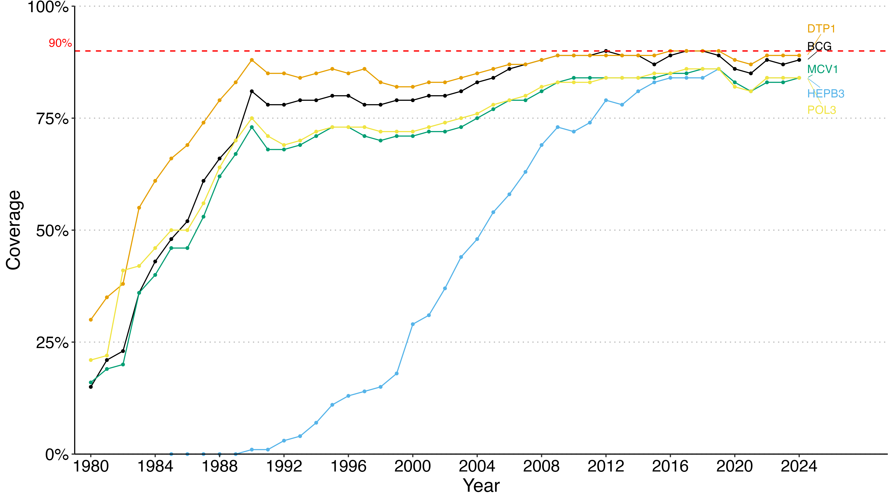{width="100%"}

## Coverage disparities exist within and between regions

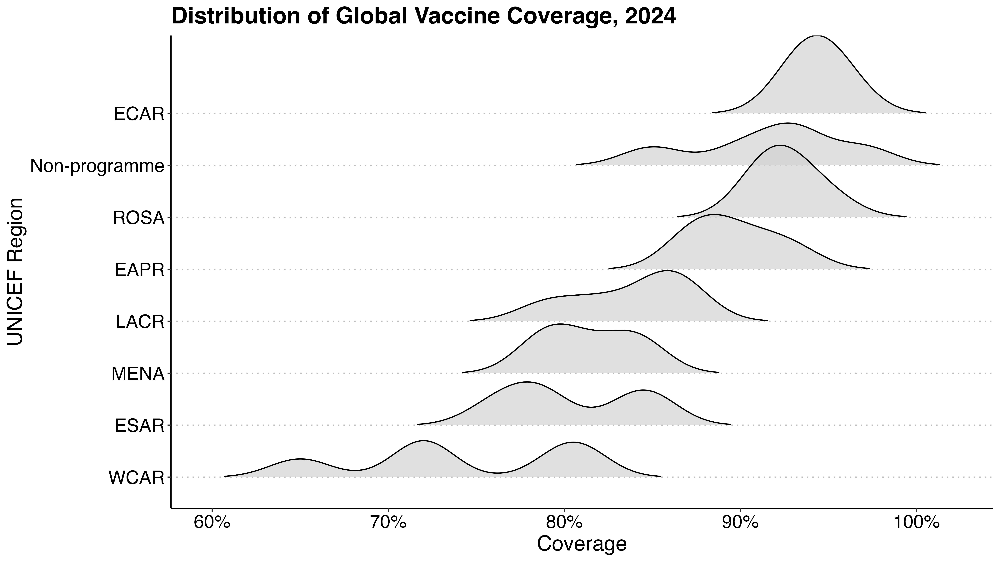{width="100%"}


## 

:::: {.columns}
::: {.column width="33%"}
### Global support for increasing immunization
14 of the 17 United Nations Sustainable Development Goals demonstrate the social and economic value of [increasing]{.remember} immunization [coverage]{.remember}.
:::

::: {.column width="65%"}
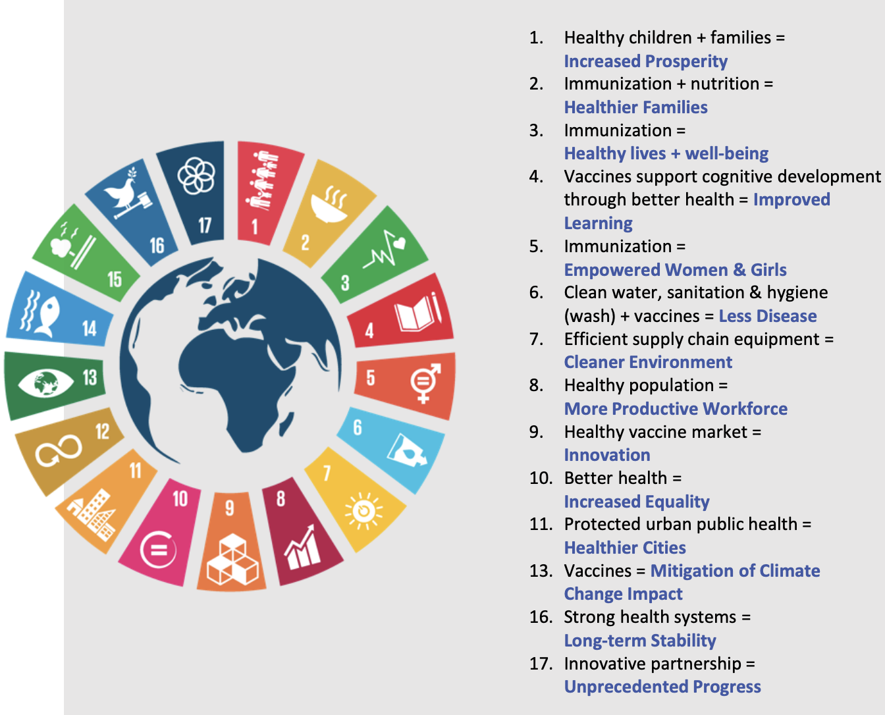{width="100%"}
:::
::::

## 

:::: {.columns}
::: {.column width="30%"}
{.image-left}
:::

::: {.column width="70%"}
### Outline

- [Immunisations coverage and disparities]{.graylight}

- [Immunisation Supply Chain (iSC) importance and performance]{.remember}

- Effective Vaccine Management (EVM) initiative 

- Analytics for Improving iSC with EVM

:::
::::

##  The importance of the supply chain

Each successful vaccination depends on a complex immunization supply chain (iSC) to ensure that the correct vaccine is administered at the right [cost, time and place]{.remember}.


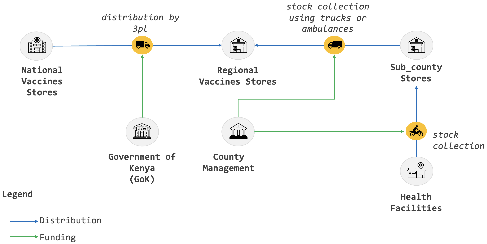{width="100%" fig-align="center"}


##

:::: {.columns}
::: {.column width="50%"}
### The Gavi Alliance iSC Strategy 

The performance of the immunization supply chain is defined by:

- the [availability]{.remember} of vaccines
- the [quality]{.remember} of those vaccines
- the [efficiency]{.remember} of the system
:::

::: {.column width="50%"}
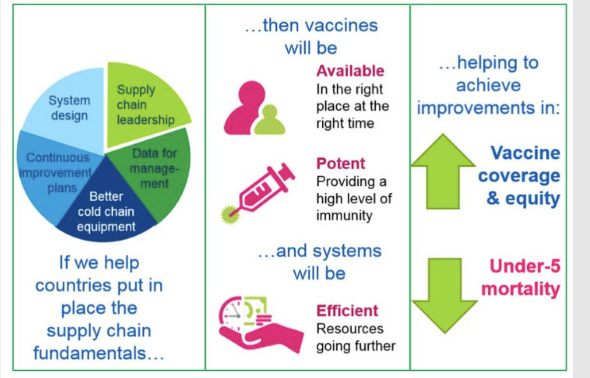{width="100%" fig-align="center
}
:::
::::

::: aside
Source of image: [WHO EVM Document](https://evm2.who.int/Public/Resources)
:::

## 

:::: {.columns}
::: {.column width="30%"}
{.image-left}
:::

::: {.column width="70%"}
### Outline

- [Immunisations coverage and disparities]{.graylight}

- [Immunisation Supply Chain (iSC) importance and performance]{.graylight}

- [Effective Vaccine Management (EVM) initiative]{.remember}

- Analytics for Improving iSC with EVM

:::
::::

## {background-image="img_who/evmtool1.png" background-size="contain" background-position="right" footer=false}

::::{.columns}
::: {.column width="55%"}
### A global initiative to improve immunization supply chain.

A national planning process endorsed and supported by WHO and UNICEF

EVM provides materials and tools needed to monitor and assess vaccine supply
chains and help countries improve their supply chain performance.
:::
::: {.column width="45%"}

:::
::::

## EVM Framework 

The EVM assessment framework defines the way in which vaccine supply chain systems are assessed. 

It is organised by:

::: incremental
- **Criteria:** the operational or management functions that health facilities must perform; define what area of the supply chain is being assessed: Vaccine arrivals (E1), temperature management (E2), and waste management (E9).

- **Categories:** determine the necessary inputs, outputs, and performance required to execute the functions defined by the Criteria.
  -  **Inputs (C1–C6):** What is required to perform the function, such as Infrastructure (C1), Equipment (C2), and Financial Resources (C6).
  - **Outputs (O):** The deliverables produced by staff, such as records, charts, or reports.
  - **Performance (P):** The outcomes of proper implementation, such as vaccine availability and the absence of heat-damaged vaccines.

:::


## EVM Framework

The EVM assessment framework defines the way in which vaccine supply chain systems are assessed. 

It is organised by:

- [**Criteria:** Define what area of the supply chain is being assessed]{.graylight}
- [**Categories:** determine the necessary inputs, outputs, and performance required to execute the functions defined by the Criteria.]{.graylight}
  
- **Requirements:** specific minimum standards, or attributes that a well-functioning immunisation supply chain must have; Human Resources (R0136): "iSC [immunization Supply Chain] staff have work mobile phones"

- **Questions:** Provide the data to score Requirements: Interviewing, Verifying, Observing, Calculating.


:::aside
Scoring in EVM is determined by this assessment framework.
:::

## 

::::{.columns}
::: {.column width="55%"}
### EVM Dataset Overview
- Assessments from 82 countries between 2019 and 2024.
  - 4287 health facilities (rows).
  - 1108 variables (columns).


- 1286 potential questions.
  - 871 requirements, 19 criteria and 8 categories.
  - Scores range from 0 to 5.
:::

::: {.column width="40%"}
::: fragment

### [EVM Framework Guide](https://storage.googleapis.com/technet-media/media/com_khub/uploaded/1936%2FEVMAssessorGuidev1.01EN.pdf?g=1706741641240538&alt=media){preview-link="true"}

**R0001:** The facility has a functional landline telephone.

**E2:** Temperature management 

**M1:** Annual needs forecasting 

**ST:** Strategic planning 

**C1:** Infrastructure

**C3:** Information technology
:::

:::

::::


## Data - Scores {.scrollable}

```{r}
#| echo: false
#| message: false
#| warning: false

library(readr)
library(DT)
library(here)
evm_scores <- read_csv(here("data/sample_evm.csv"))

DT::datatable(
  evm_scores,
  options = list(
    scrollX = TRUE,     # enables horizontal scrolling
    pageLength = 10     # adjust number of rows per page as needed
  ),
  rownames = FALSE,
  class = "stripe hover"
)
```

## 

:::: {.columns}
::: {.column width="30%"}
{.image-left}
:::

::: {.column width="70%"}
### Outline

- [Immunisations coverage and disparities]{.graylight}

- [Immunisation Supply Chain (iSC) importance and performance]{.graylight}

- [Effective Vaccine Management (EVM) initiative]{.graylight}

- [Analytics for Improving iSC with EVM]{.remember}

:::
::::


## Project objectives {.center}

- Exploratory analysis to diagnose system fragility and performance drivers.

- Explain performance and coverage using causal machine learning models.

- Develop a prescriptive optimisation framework that converts analytical findings into actionable guidance for policymakers and stakeholders.

::: fragment
### Expected Impact
The output of this project will support policymakers in [allocating resources more effectively]{.remember}, and [selecting high-impact interventions]{.remember}.
:::

## For this talk {.center}

- [Exploratory analysis to diagnose system fragility and performance drivers.]{.remember}

- [Explain performance and coverage using causal machine learning.]{.graylight}

- [Develop a prescriptive optimisation framework that converts analytical findings into actionable guidance for policymakers and stakeholders.]{.graylight}


## Dimension Reduction

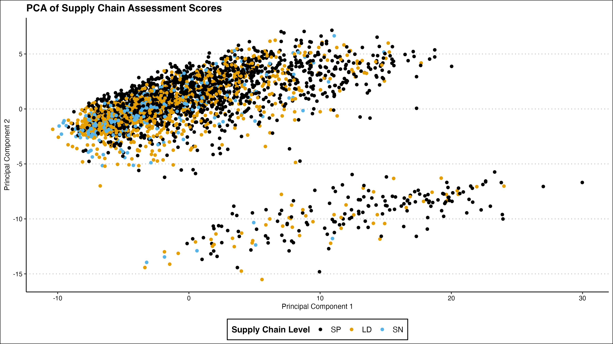{width="100%" fig-align="center"}


## Empirical Cumulative Distribution Function (ECDF)

::::{.columns}
::: {.column width="50%"}
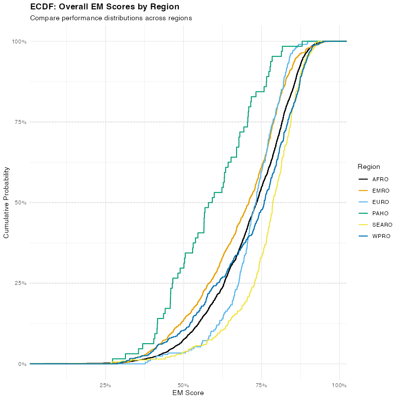{width="100%" fig-align="center"}
:::

::: {.column width="50%"}
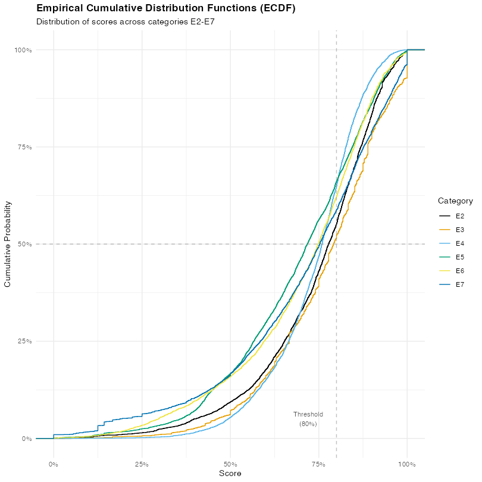{width="100%" fig-align="center"}
:::
::::


## 

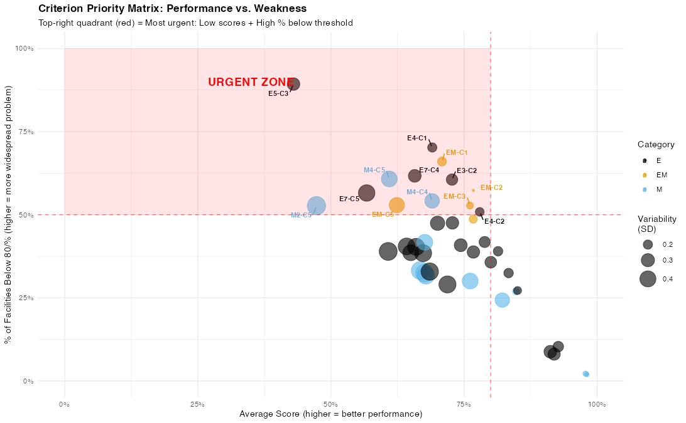{width="100%" fig-align="center"}

## Service Points Showing Lowest Availability

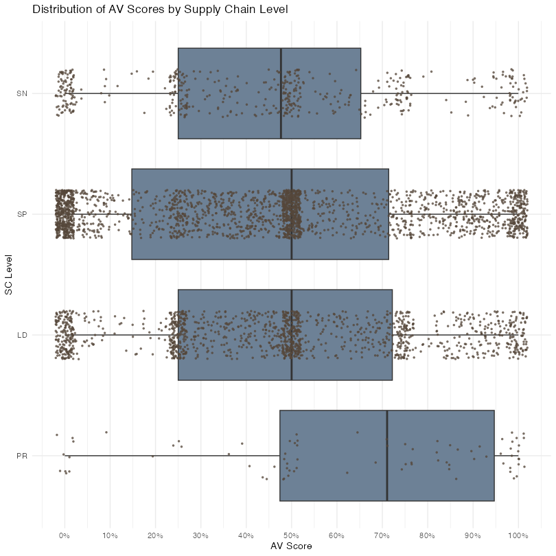{width="100%" fig-align="center"}


## Last-Mile Fragility in iSC

::::{.columns}
::: {.column width="25%"}
### Persistent Underperformance and High Variability at Service Points
:::

::: {.column width="75%"}
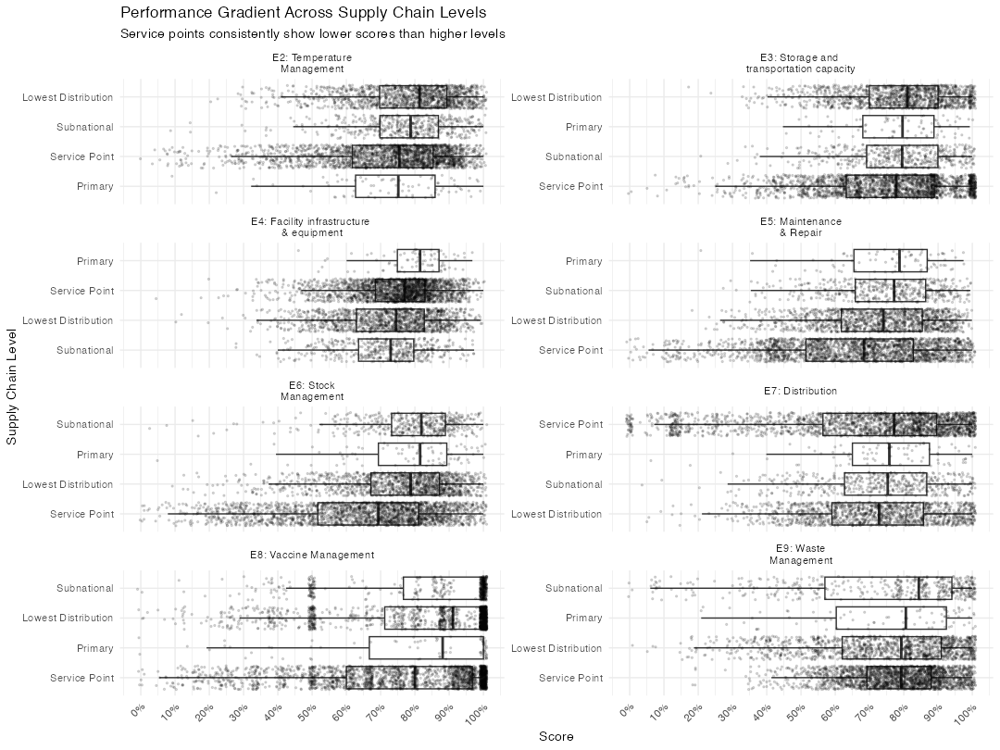{width="100%" fig-align="center"}
:::
::::


## [Any questions or comments?]{.remember} 💬 {background-video="https://www.pexels.com/download/video/12165750/" background-video-loop="true" background-video-muted="true"}

{fig-align="center"}

## References {background-image="https://images.unsplash.com/photo-1550399105-05c4a7641b02?ixlib=rb-1.2.1&ixid=MnwxMjA3fDB8MHxwaG90by1wYWdlfHx8fGVufDB8fHx8&auto=format&fit=crop&w=774&q=80" background-size="contain" background-position="right"}

- [Effective Vaccine Management (EVM) Initiative](https://evm2.who.int/Public/)
- [UNICEF Immunization Data](https://data.unicef.org/resources/dataset/immunization/)

:::aside
Image credit: [Unsplash](https://unsplash.com)
:::